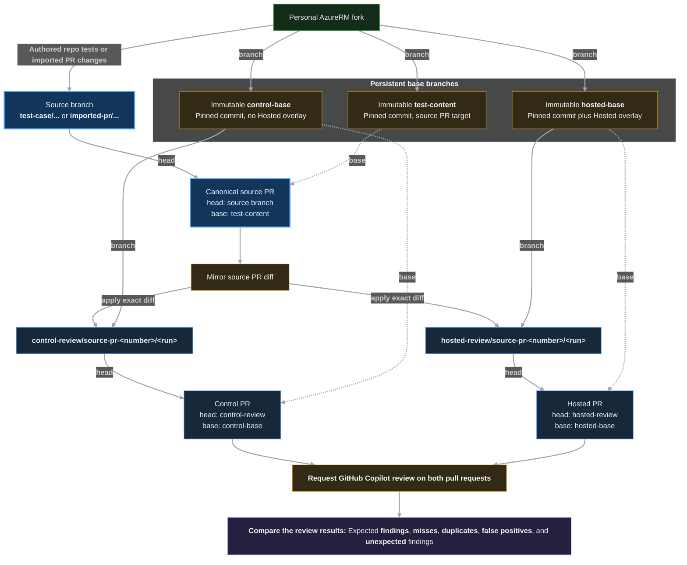

# Hosted Copilot Code Review Implementation Guide:

This guide defines how to implement the Hosted Toolkit described in [`docs/HOSTED_COPILOT_CODE_REVIEW_ARCHITECTURE.md`](../../docs/HOSTED_COPILOT_CODE_REVIEW_ARCHITECTURE.md).

The architecture document remains authoritative for product boundaries, rationale, trust, budgets, and adoption criteria. This guide owns the implementation sequence and the concrete first-party GitHub repository shape used during the Experiment MVP.

## Implementation Boundary:

Build the Hosted Toolkit directly from GitHub's documented customization model. Do not copy, transform, or depend on customization files from prior experiments in another repository.

Prior experiments are evidence about prompt limits, review behavior, and evaluation design. They are not an implementation source, migration baseline, or package layout.

All Hosted Toolkit files must be authored beneath `hosted_copilot/`. Nothing in this guide changes the Interactive Toolkit runtime, installer manifest, release bundle, or validation ownership.

## First-Party GitHub Shape:

GitHub documents the following repository customization paths for Copilot code review:

- [Repository-wide custom instructions](https://docs.github.com/en/copilot/customizing-copilot/adding-repository-custom-instructions-for-github-copilot) use `.github/copilot-instructions.md`.
- Path-specific custom instructions use `NAME.instructions.md` files beneath `.github/instructions/`.
- Each path-specific instruction file begins with YAML frontmatter containing an `applyTo` glob.
- Repository-wide and every matching path-specific instruction file are combined for a reviewed file.
- [Agent skills used by code review](https://docs.github.com/en/copilot/using-github-copilot/code-review/using-copilot-code-review#mcp-servers-and-agent-skills) live beneath `.github/skills/`; a review-focused directory name and description improve relevance.
- Repository instructions, agent instructions, and agent skills are read from the pull request head branch.
- Custom instructions must remain enabled for Copilot code review in repository settings.

The Hosted Toolkit source must mirror those destination paths exactly:

```text
hosted_copilot/
  CHANGELOG.md
  .github/
    copilot-instructions.md
    instructions/
      azurerm-go.instructions.md
      azurerm-tests.instructions.md
      azurerm-docs.instructions.md
    skills/
      code-review/
        SKILL.md
  docs/
    HOSTED_COPILOT_CODE_REVIEW.md
    HOSTED_COPILOT_CODE_REVIEW_IMPLEMENTATION.md
    HOSTED_REVIEW_EXPERIMENT_RUNBOOK.md
  regression/
    README.md
    cases/
    schema/
    raw/
    results/
  rules/
    instruction-catalog.json
    instruction-catalog.schema.json
  tools/
    Capture-ReviewPair.ps1
    Close-ReviewPair.ps1
    Generate-Instructions.ps1
    Review.Common.psm1
    Import-PullRequest.ps1
    Initialize-ReviewBases.ps1
    Install-Toolkit.ps1
    New-ReviewPair.ps1
    Publish-TestCase.ps1
    Test-ReviewResults.ps1
    Test-InstructionGeneration.ps1
    Test-Toolkit.ps1
    Test-UpstreamSources.ps1
    package-manifest.json
```

The relative path below `hosted_copilot/` is the destination path in the target repository. The implementation must not introduce a generated package directory, path-rewriting layer, Hosted release bundle, or Hosted version file.

## Experiment MVP Scope:

The Experiment MVP implements only the assets required to test whether compact Hosted guidance improves Copilot code review without reproducing the Interactive Toolkit.

**Implement During The Experiment:**

- Compact repository-wide review guidance
- Compact Go, acceptance-test, and documentation instructions
- Curated mandatory maintainer conventions identified from the Interactive Toolkit, including tribal knowledge, with each rule's requirement strength, provenance, and Hosted applicability reviewed before inclusion
- A normalized Hosted rule catalog that preserves every current rule as active and records upstream standards, confirmed and inferred maintainer conventions, and local safeguards independently
- Deterministic path-specific instruction generation with byte-for-byte freshness validation
- Read-only drift and catalog-coverage detection across the contributor README and every indexed contributor topic, including documents not yet cited by active Hosted rules
- AI-assisted semantic intake from complete upstream contributor guidance and the complete Interactive rule inventory, with persisted decisions and explicit maintainer approval
- Structured current and projected token reporting for each runtime file and combined review surface
- One review-focused agent skill
- A package manifest for exact deployment ownership
- A source-checkout deployment script with dry-run support
- Hosted structure, isolation, and token-budget validation
- Controlled test cases and result records for paired reviews
- User-facing Hosted setup and maintenance documentation

**Defer Until Adoption:**

- Unattended semantic interpretation or automatic application of upstream contributor-document changes
- Production-scale regression infrastructure
- Hosted-specific CI rollout
- Versioned Hosted releases or archives

During the experiment, the normalized catalog is the authority for path-specific rules. Generated instruction files are committed and frozen by Git commit for deployment, but they are consumers rather than a second rule authority. Repository-wide instructions and the review skill remain curated because they define Hosted process and trust boundaries rather than contributor rules.

## Runtime File Responsibilities:

### Repository-Wide Instructions:

`hosted_copilot/.github/copilot-instructions.md` contains only guidance needed for every Hosted review:

- Repository purpose and important evidence locations
- The required review procedure, including mandatory use of the `code-review` skill
- Contributor guide precedence over path-specific rules
- Actionable-defect threshold
- Evidence hierarchy for establishing what changed code does
- Finding attribution to the enforcing rule ID or contributor guide section
- Duplicate-feedback avoidance
- Concise inline-comment expectations
- Trust rules for Hosted customization changes and changed contributor guidance
- Pointers to deterministic checks that are safe in the Hosted environment

Do not place detailed Go, test, or documentation requirements in this file.

### Go Instructions:

`hosted_copilot/.github/instructions/azurerm-go.instructions.md` uses:

```yaml
---
applyTo: "internal/**/*.go"
---
```

It contains compact, high-value rules that can identify correctness, compatibility, Azure API, Terraform state, schema, lifecycle, or provider behavior defects.

The Go instructions also apply to acceptance-test files. Shared Go requirements belong here and must not be repeated in the test supplement.

### Test Instructions:

`hosted_copilot/.github/instructions/azurerm-tests.instructions.md` uses:

```yaml
---
applyTo: "internal/**/*_test.go"
---
```

It supplements the Go instructions with acceptance-test-specific requirements. It focuses on lifecycle coverage, import behavior, assertion defects, unsafe execution claims, and established provider test patterns.

### Documentation Instructions:

`hosted_copilot/.github/instructions/azurerm-docs.instructions.md` uses:

```yaml
---
applyTo: "website/docs/**/*.html.markdown"
---
```

It contains published documentation requirements and mandatory confirmed maintainer conventions. Published requirements include canonical contributor-guide examples and templates when they prescribe the required documentation shape, including `*` list markers for argument and attribute entries. It must also include the Oxford comma requirement for documentation prose lists of three or more items.

## Normalized Instruction Generation:

### Authority And Preservation:

`hosted_copilot/copilot-rule-catalog/instruction-catalog.json` is the authority for the three path-specific instruction files. Its schema records each stable rule ID, exact runtime text, active or retired status, migration origin, provenance, evidence references, upstream source mappings, implementation model applicability, shared requirement defaults, and known upstream documentation gaps.

Implementation rules classify applicability across `legacy`, `typed`, and `framework`. Legacy identifies function-based untyped Plugin SDK maintenance surfaces, typed identifies ordinary receiver-based `internal/sdk` resources and data sources, and framework identifies framework-native or specialized surfaces. The generator renders this applicability with each implementation rule so review does not apply typed or framework patterns to legacy code, or treat maintenance as an implicit migration.

The catalog must preserve every applicable Hosted path-specific requirement, including requirements drawn from Interactive Toolkit compliance contracts that the contributor guide does not already mandate. Each rule with an Interactive compliance-contract counterpart must be `active`, retain the counterpart's requirement meaning, and record `hosted-baseline-migration` as its origin. The generator must reproduce the committed instruction files byte-for-byte before any catalog change can be accepted.

Use `hosted-catalog-addition` as the origin for a rule that has no Interactive compliance-contract counterpart and was first introduced through the normalized catalog. Origin records how the rule entered the catalog; provenance separately records why the rule is authoritative.

Published upstream standards, confirmed maintainer conventions, inferred maintainer conventions, and local safeguards remain independent provenance classes. Missing upstream coverage must never remove or weaken a maintainer convention. Hybrid rules may record more than one provenance class. A rule can leave runtime output only through an explicit `retired` status and retirement reason.

### Generate Or Check Instructions:

Check whether the committed files match the catalog without writing:

```powershell
pwsh -NoProfile -File ./hosted_copilot/tools/Generate-Instructions.ps1
```

After reviewing an intentional catalog change, update all stale generated files explicitly:

```powershell
pwsh -NoProfile -File ./hosted_copilot/tools/Generate-Instructions.ps1 -Write
```

The command validates the catalog schema, unique rule IDs, source and evidence references, provenance-specific evidence, active-rule coverage, output containment, and deterministic content. Check mode fails when a generated file is stale. Write mode changes only the catalog-owned path-specific instruction files.

`Test-InstructionGeneration.ps1` exercises baseline freshness, catalog-native rule origins, read-only stale detection, and explicit writes entirely in a temporary Hosted root. `Test-Toolkit.ps1` runs this regression suite as part of the complete Hosted profile.

### Review Upstream Drift:

Run the Hosted-owned source check independently from the Interactive Toolkit:

```powershell
pwsh -NoProfile -File ./hosted_copilot/tools/Test-UpstreamSources.ps1 -FailOnDrift
```

The command fetches the contributor README and every contributor topic in the Hosted source catalog, including documents not cited by an active Hosted rule. It compares raw-content SHA-256 values with approved baselines, reports affected rule IDs when mappings exist, and fails when the contributor README exposes an untracked topic or the catalog retains a stale topic. It is read-only and never updates the catalog. A changed digest or topic-coverage issue requires semantic maintainer review. Update approved rule text only when source meaning changed; update a baseline only after recording that review in the same catalog change.

### Semantic Rule Intake:

#### Shared Invariant:

Semantic intake may produce a review bundle and proposed Hosted catalog changes. It must never change source baselines, intake decisions, normalized rules, generated instructions, or regression expectations before a maintainer explicitly approves the proposal.

Deterministic scripts own source collection, hashing, rule-block extraction, mapping, rendering, token projection, and validation. AI owns semantic comparison and candidate classification. The maintainer owns every final adoption, update, retirement, exclusion, deferral, and baseline-acceptance decision.

#### Candidate Sources:

Review all three candidate channels on their own terms:

- The upstream contributor channel contains the contributor README and every indexed topic. It is authoritative for published standards but does not contain all maintained provider conventions.
- The Interactive knowledge channel contains every Interactive contract rule. It is evidence for maintainer conventions, local safeguards, and cross-cutting review behavior, but it is not a Hosted runtime source.
- The Maintainer Proposals channel contains hand-authored rules for missing Hosted review behavior that neither other source contains. It is Hosted-owned maintenance input, not deployed runtime guidance.

Author Maintainer Proposals in these source-only files:

- `hosted_copilot/copilot-rule-catalog/maintainer-rules/documentation.rules.md`
- `hosted_copilot/copilot-rule-catalog/maintainer-rules/implementation.rules.md`
- `hosted_copilot/copilot-rule-catalog/maintainer-rules/testing.rules.md`

Each rule uses an instruction-style `### RULE-ID: Title` heading followed by exactly one `Rule`, `Provenance`, and `Rationale` bullet. `Status` is optional and defaults to `active`; use `retired` only after the rule maps to a Hosted catalog record. Documentation IDs start with `DOCS-`, implementation IDs with `IMPL-`, and testing IDs with `TEST-`. Allowed provenance values are `confirmed-maintainer-convention`, `inferred-maintainer-convention`, and `local-safeguard`.

The initial Interactive intake audit must classify all 349 currently active rules. The three directly applicable contract families currently contain 158 rules: 102 documentation rules, 36 implementation rules, and 20 testing rules. Fifty-three IDs overlap the current Hosted catalog, leaving 105 direct candidates before semantic equivalence review. These counts describe the initial baseline and must not become hard-coded future limits.

Review direct implementation, testing, and documentation candidates first. Then review cross-cutting code-review rules and the remaining workflow-specific families. Do not automatically exclude a rule from its contract path alone; record a semantic decision for every rule.

#### Interactive Intake Ledger:

Add `hosted_copilot/copilot-rule-catalog/interactive-intake-ledger.json` and `interactive-intake-ledger.schema.json` as Hosted-owned maintenance files. They must remain outside the deployed package manifest.

Each ledger record must contain:

- `sourceRuleId`
- `sourceContractPath`
- `sourceContentSha256`
- `sourceStatus`
- `decision`
- `rationale`
- `reviewedOn`
- `hostedRuleIds`
- `selectionFactors`
- `selectionRationale`
- `foundationalOverride`

Use `equivalent`, `included`, `excluded`, or `deferred` as durable ledger states. An unchanged content hash keeps the decision current. A new rule, changed content hash, or lifecycle change reopens review. An `equivalent` or `included` decision must identify the corresponding Hosted rule ID. An `excluded` or `deferred` decision must explain the Hosted applicability, evidence, duplication, regression, or token constraint.

The ledger preserves completed review work without coupling normal Hosted validation to Interactive Toolkit changes. The complete Hosted validator may validate ledger shape and Hosted references, but only the explicitly invoked intake command may compare the ledger with the current Interactive catalog and contracts.

#### Review Bundle:

Add `hosted_copilot/tools/New-RuleIntakeReview.ps1` as a read-only evidence collector. It must:

- Validate the Hosted catalog and intake ledger before analysis.
- Collect changed upstream documents with immutable baseline and current source identity.
- Extract exact Interactive rule blocks from the hand-authored contracts and verify their hashes against the Interactive catalog.
- Parse strict instruction-style Maintainer Proposal blocks, generate their hashes and structured metadata, and map exact Hosted rule IDs without requiring hand-authored JSON.
- Include baseline, new, changed, retired, and deferred Interactive records requiring semantic review.
- Include current Hosted rules and existing mappings relevant to each candidate.
- Write generated review artifacts only to an explicit output directory or an external temporary directory.
- Return structured JSON without modifying either toolkit.

The instruction catalog pins the approved upstream baseline commit. Bundle generation resolves the current upstream ref to a commit before fetching content, so both sides of every comparison are immutable and reproducible. It rejects a baseline commit that does not reproduce every approved source hash.

Run the collector directly to refresh candidates or create a Workbench input artifact:

```powershell
pwsh -NoProfile -File ./hosted_copilot/tools/New-RuleIntakeReview.ps1 -OutputPath <external-path>/rule-intake-review.json
```

The bundle classifies Interactive rules as `new`, `changed`, `retired`, `deferred`, or `current`. It classifies Maintainer Proposals as `new`, `changed`, `retired`, or `current` by comparing source status and exact rule text with the same Hosted rule ID. A source content hash, lifecycle, or contract-path change reopens a prior decision. Exact normalized contract rule text must match the Interactive catalog hash before it enters the bundle.

Refresh candidates by restarting the Workbench or invoking the collector and assessor directly. The browser does not expose a refresh action because its staged bundle is fixed for the server lifetime. Candidate regeneration does not update the ledger, catalog, source baselines, or generated instructions.

Do not make the Hosted package or complete Hosted validator depend on the current Interactive Toolkit. The intake command is a repository-maintenance bridge invoked only when a maintainer requests an audit.

#### Automated Semantic Assessment:

Run the incremental assessment command when creating a complete Workbench bundle:

```powershell
pwsh -NoProfile -File ./hosted_copilot/tools/Invoke-RuleIntakeAssessment.ps1 -OutputPath <external-path>/rule-intake-review.json
```

The command invokes `New-RuleIntakeReview.ps1`, partitions cache misses into bounded source-specific batches, and calls the local Copilot CLI noninteractively with the configured model and reasoning effort. Upstream contributor documents use a separate, smaller batch-size limit because each candidate carries complete document content. Each model call runs in an isolated evidence directory containing only the batch, current Hosted catalog, and assessment schema; expose only the read-only `view` tool, consume the raw assistant message from JSONL output, and verify the reported model. Validate each candidate ID, source hash, semantic field, and final bundle schema, and fail closed after bounded malformed-output retries. Tests inject a fake evaluator and must never invoke a model.

The committed shared baseline lives under `hosted_copilot/copilot-rule-catalog/rule-assessments/` and contains only source identity, source-content hash, and validated assessment records. It does not duplicate candidate source documents, capacity reports, or Workbench state. Resolve assessments in this order:

1. Use a machine-local cache entry matching source identity, source-content hash, Hosted catalog hash, evaluator contract hash, model, and reasoning effort.
2. Use a committed baseline entry matching source identity and source-content hash when the baseline targets the current Hosted catalog.
3. Invoke Copilot for the remaining candidates.

A changed source rule normally reassesses only that candidate. A changed Hosted catalog invalidates the shared baseline and relevant local cache because the semantic comparison target changed. Evaluator-contract, model, and reasoning changes invalidate local cache entries but do not erase a maintainer-accepted shared baseline. Cache files, batch artifacts, and assessed bundles must remain outside the repository.

After reviewing and accepting a complete refreshed bundle, preview and then explicitly publish the next shared baseline:

```powershell
pwsh -NoProfile -File ./hosted_copilot/tools/Publish-RuleIntakeAssessmentBaseline.ps1 -BundlePath <external-path>/rule-intake-review.json
pwsh -NoProfile -File ./hosted_copilot/tools/Publish-RuleIntakeAssessmentBaseline.ps1 -BundlePath <external-path>/rule-intake-review.json -Publish
```

The publisher rejects unevaluated candidates and source-hash mismatches, validates the compact baseline schema, previews without writing by default, and replaces only the baseline file when `-Publish` is explicit.

Assessment is explicitly invoked maintainer automation. It produces a read-only bundle and never updates the Hosted catalog, intake ledger, source baselines, generated instructions, regression assets, or shared assessment baseline. Only the separate explicit publisher may update the shared assessment baseline. Neither command authorizes unattended semantic synchronization or automatic rule promotion.

#### Decision Proposal:

AI-assisted review consumes the deterministic bundle and emits one proposal record per candidate:

- `no-change`: The source changed without changing applicable rule meaning.
- `add`: Add a new Hosted-owned rule with origin `hosted-catalog-addition`.
- `update`: Replace materially changed Hosted rule meaning through the approved lifecycle process.
- `retire`: Retire Hosted behavior that is no longer valid and is not independently preserved by maintainer evidence.
- `exclude`: Record that the source behavior is not applicable to Hosted review.
- `defer`: Record the unresolved evidence, applicability, regression, or capacity gap.

Every proposal must cite its source evidence, identify affected Hosted surfaces, distinguish published guidance from maintainer knowledge, and explain whether an existing Hosted rule already covers the same failure condition. A proposal is review output only; it grants no write authority.

#### Impact-Weighted Selection:

Apply eligibility gates before calculating impact. A rule is eligible only when it applies to native Hosted review, can produce an actionable finding or necessary cross-cutting safeguard, has sufficient evidence, and is not materially duplicated by stronger Hosted behavior. A failed eligibility gate requires an `exclude` or `defer` proposal regardless of score.

The AI semantic review pass assigns eligibility, recommendation, selection factors, and selection rationale. These values are read-only in the Workbench. The maintainer independently chooses one catalog-status-constrained rule action, controls whether add, update, or retire enters the promotion plan, records decision rationale, and owns final approval. Every new maintainer decision begins at no change rather than silently adopting the AI recommendation. If the maintainer disputes factor evidence or scoring, defer the candidate or request another AI assessment; do not overwrite the factor values manually.

Rate each eligible rule from `0` through `5` on these independently justified factors:

- `severity`: Consequence of the defect or review failure the rule prevents
- `frequency`: Evidence-backed likelihood of the failure in provider changes
- `breadth`: Applicability across resources, services, and review surfaces
- `hostedDetectability`: Likelihood that Hosted review can prove and locate the problem reliably
- `evidenceStrength`: Durability and authority of the supporting evidence
- `falsePositiveRisk`: Likelihood that the rule produces unsupported or noisy findings
- `redundancy`: Degree to which existing Hosted guidance already covers the same failure condition

Do not rate missing evidence optimistically. Use `defer` when an unknown factor materially affects the inclusion decision.

Calculate the derived impact score as:

```text
impactScore = max(0, 6*severity + 3*frequency + 3*breadth + 4*hostedDetectability + 4*evidenceStrength - 5*falsePositiveRisk - 3*redundancy)
```

For candidates with a positive guarded token delta, calculate token efficiency as:

```text
tokenEfficiency = 100 * impactScore / guardedTokenDelta
```

This reports impact points per 100 guarded tokens. Retirements and text reductions report token savings instead of an efficiency ratio. The proposal must show every factor rating and rationale; it must not present the derived score as objective fact.

Store `selectionFactors` and `selectionRationale` on every active Hosted rule and on every Interactive intake-ledger decision. Calculate `impactScore` and `tokenEfficiency` from those inputs rather than storing them. The initial intake implementation must backfill the current 54 Hosted rules before using score-based ranking for new candidates.

Foundational safeguards may be necessary because they improve the reliability of many other rules rather than directly identifying one frequent defect. Set `foundationalOverride` only with a concrete package-level rationale, affected rule IDs or surfaces, and explicit maintainer approval. An override does not bypass token projection, evidence requirements, or the final approval gate.

Use impact and token efficiency to order eligible candidates and explain tradeoffs. Never automatically include, exclude, or retire a rule from its score alone.

#### Token Projection:

Token reporting uses the dependency-free character-quarter estimate and the existing 25% safety margin. It must not be described as actual GitHub runtime token consumption.

Run the shared read-only capacity command directly when inspecting current usage:

```powershell
pwsh -NoProfile -File ./hosted_copilot/tools/Get-GuidanceCapacity.ps1 -OutputFormat Json
```

`Get-GuidanceCapacity.ps1` is the single arithmetic owner for current capacity. `New-RuleIntakeReview.ps1` embeds its complete eight-report result in each candidate bundle, and `Test-Toolkit.ps1 -OutputFormat Json` exposes the same result under `guidanceCapacity`. Consumers must not reconstruct capacity from validator detail text.

For every current and projected runtime file and combined review surface, report:

- `estimatedTokens`
- `guardedTokens`
- `budgetTokens`
- `budgetHeadroomTokens`
- `utilizationPercent`

For every proposed add, update, or retirement, also report `estimatedTokenDelta`, `guardedTokenDelta`, `impactScore`, `tokenEfficiency` when defined, and the projected post-change values. Calculate projections by rendering the complete proposed catalog in a temporary Hosted root. Do not estimate a rule in isolation because section headings, model markers, ordering, and shared guidance affect the rendered totals.

Implementation rules affect the Go file budget, the Go combined budget, and the test combined budget because test files load both Go and test instructions. Test rules affect the test file and test combined budgets. Documentation rules affect the documentation file and documentation combined budgets. Repository-wide or review-skill changes affect every applicable combined surface.

Derived token values belong in validator and proposal output. Do not store them manually in the rule catalog or intake ledger, where they would become stale.

#### Hosted Rule Workbench:

The static proof-of-concept interface lives beneath `hosted_copilot/workbench/`. Launch it with:

```powershell
pwsh -NoProfile -File ./hosted_copilot/tools/Start-RuleWorkbench.ps1
```

By default, the launcher completes two visible phases. The assessment phase first collects candidates, reports cache and committed-baseline reuse, streams each required AI assessment batch, and prints its completion summary. Only after assessment succeeds does the Workbench phase stage the completed bundle and report the server as ready at `http://127.0.0.1:43143/`. This separation prevents a long assessment from appearing to be a hung server launch. A fresh checkout with a current baseline does not rebuild existing assessments locally. JSON output remains a single machine-readable result and therefore captures assessment details instead of streaming text. Static content accepts only `GET` and `HEAD`; the sole process-lifecycle exception is a per-launch-token-authenticated `POST /shutdown` used by **Close Workbench**. It stops the local server and grants no repository-write authority. The stable origin preserves browser storage across launches. Use `-BundlePath` to stage a prebuilt schema-valid bundle without collecting candidates. `-StageOnly` validates staging without starting the server, and `-NoLaunch` keeps the launcher from opening a browser automatically.

The Workbench supports laptop and desktop browsers only. At viewport widths below `768px`, or when the browser identifies as mobile, display the unsupported-device screen and do not load the candidate bundle or initialize IndexedDB. Do not maintain a separate responsive handset workflow for rule assessment or promotion.

Use IndexedDB for bundles, read-only AI assessments, maintainer choices, evidence notes, and resumable drafts. Use local storage only for lightweight preferences and the active session ID. Key every decision and assessment to its source identity and content hash so changed input invalidates prior analysis. Support explicit draft export and import because browser storage is a convenience rather than the durable promotion boundary.

The proof of concept does not run a model inside the browser. Semantic evaluation must complete before a candidate appears in either Workbench tree. Do not show unevaluated candidates or invent fallback scores. Bind every assessment to the candidate source-content SHA-256 and reject stale assessments.

Place a tab control directly below the shared search toolbar. The **Candidate Sources** tab contains a second connected **Candidates** and **Details** tab set. Those views replace each other at full workspace width: activating a candidate row opens Details, returning to Candidates preserves expanded folders, selection, sorting, and scroll position, and checkbox changes select the candidate without leaving the list. Details remains available without a selection and shows a **Select a candidate** empty state instead of stale form content. The **Assessment Results** tab uses the same nested pattern at every supported viewport: connected **Assessments** and **Details** tabs replace one full-width pane with the other. Activating an assessment row opens Details, returning to Assessments preserves the selected key and visible row highlight, and a fresh load initializes Assessments with no selection so Details shows **Select an assessment result**. Keep both outer tab DOMs and both nested pane DOMs alive so switching visibility does not reset state. The one search input queries only the currently selected outer tab's dataset and restores that tab's independent query on return; do not add a second search bar or eligibility-mode controls inside Assessment Results. Show source rule, applicability decision, AI recommendation, impact and factor evidence, exact mapped Hosted coverage, and maintainer-proposal rationale when present. Do not expose Rule Actions, editable decision rationale, plan checkboxes, or any other promotion affordance in Assessment Results.

At desktop widths, constrain the application shell to the viewport so the top bar and left stage rail do not move. Catalog keeps metrics, search, outer tabs, and Candidates/Details fixed while the active tree, assessment-result list, or detail form scrolls within the remaining height. Promotion Plan keeps its page heading and Plan Projection fixed while the table owns both scroll axes and keeps column headings sticky. Preview keeps its page heading and Draft Summary fixed while one right-hand container scrolls Proposed Changes, Payload Changes, and Raw Selection Payload together. Preserve normal document flow below the desktop breakpoint.

Organize promotion-eligible candidates beneath non-selectable **Interactive Toolkit**, **Contributor Guidance**, and **Maintainer Proposals** source roots in **Eligible Candidates**. Place provisionally reincluded candidates once in a separate, expanded **Overrides** group before those source roots; do not duplicate them in their normal category. Interactive and maintainer category folders are navigation-only; Contributor Guidance rules are direct children of their source root. Place the candidate column header inside every row-bearing subsection. Make Candidate Sources headers independently sortable, default each subsection to Candidate ascending, and show the active ascending or descending chevron. Keep Assessment Results subsection headers informational. Show source lifecycle and authoritative Hosted catalog status as separate columns. In the compact Tokens column, an unsigned value is current guarded-token usage and a signed value is an explicit action's estimated delta. When an overridden exclusion has no AI token delta, estimate its maintained proposed text with the standard guarded character-quarter method and reuse that value in Candidate, Details, Plan, and capacity displays. Every leaf checkbox controls only promotion-plan membership, independently from Rule Action. Clicking or keyboard-activating a candidate row opens the full-width Details view and must not change plan membership, rebuild the tree, or collapse expanded folders. Up and Down Arrow on a focused candidate or assessment-result row must select, focus, and reveal the previous or next visible row without intercepting folder-summary or checkbox keyboard behavior.

The full-width Details view displays the complete selected source rule, authoritative catalog status, exact mapped Hosted rule IDs, text and placements, the AI recommendation, plain-language impact description, token cost, projected headroom, all seven factor judgments, selection rationale, related Hosted coverage, proposed Hosted wording, and editable decision rationale. Assessment details are AI-adjudicated evidence and cannot be edited. An authenticated Hosted CODEOWNER can add a source-bound provisional override to an AI-excluded result with a required rationale. Applying the override removes the row from active Assessment Results, adds it to Overrides and the promotion plan with `No Change` still selected, and retains the original AI exclusion plus override record in persisted audit data. Undo, uncheck, and Remove Override atomically remove both the decision and provisional override, return the candidate to active Assessment Results, and clear stale selections; Restore reinstates both snapshots. Carry the audit record through draft schema version 3 and selection payload version 2. Treat this as trusted maintainer discretion; do not describe it as unbypassable multi-party enforcement. Rule Actions is mutually exclusive: unmapped candidates allow no change, add, exclude, or defer; mapped candidates allow no change, update, retire, or defer; source-retired and retired-mapping cases use their narrower applicable subsets. Rule Action never changes plan membership implicitly. Every candidate uses the same checkbox flow, and a selected `No Change` item remains in the plan as **Needs action** until the maintainer explicitly chooses Add, Update, or Retire.

Use the complete available width for each Candidate Sources replacement view; do not compress Candidates and Details beside each other or introduce a breakpoint-specific split. Use IBM Plex Sans for all Workbench text and controls. Status capsules share one height, padding, border radius, type treatment, and Title Case labels while retaining semantic colors. Neutral capsules use a lighter tint of their background family for the border. Section titles use one large white Title Case style with a trailing colon; subordinate labels use one smaller white Title Case style with a trailing colon. Summary headings place the title on the left and status capsule on the right.

Use one shared subcontext-container treatment for mapped Hosted rules, AI evaluation, AI adjudication rationale, related Hosted coverage, scoring guidance, and grouped Rule Actions controls. Keep explanatory copy consistent inside those containers. Place labels outside their owned container. Group the status-constrained radio choices with their dependent promotion-plan checkbox, then keep Decision Rationale as a separate labeled control. Limit rationale to 500 characters, show a live character count, disable textarea resizing, and scroll vertically on overflow.

Assessment scoring guidance must explain how to interpret the model rather than only map numbers to adjectives. Present a single-column legend explaining the zero-through-five scale, positive Rule Value direction, negative Review Risk direction, and the special meaning of Existing Coverage. Render factor names with the shared subordinate-label style. Use non-interactive status capsules for **Adds to Impact** and **Reduces Impact**. Color Review Risk values by severity: zero through two is favorable, three is cautionary, and four through five is high risk. Do not display the former impact-per-100-tokens heading metric; token cost remains in the score strip and capacity view.

In Preview, the side-by-side selection comparison includes every changed field. Raw Selection Payload separately highlights and navigates complete in-plan Add, Update, and applicability-override decision records. An unresolved override remains visible in this audit even though approval stays blocked until the maintainer chooses an explicit promotion action.

The interface must provide these views as one process:

- A tabbed workspace beneath the search toolbar that swaps complete **Candidate Sources** and **Assessment Results** child containers, with full-width **Candidates** and **Details** replacement views inside Candidate Sources
- A searchable, excluded-only, read-only assessment-results audit containing every rejected candidate and its applicability rationale
- A searchable eligible-candidate tree with source-state and catalog-status columns, leaf-only promotion-plan checkboxes, and an action count
- An assessment workspace with the full source rule, exact mapped Hosted rule evidence, status-constrained Rule Actions, always-visible read-only AI recommendation, impact, cost, factor judgments, rationale, related Hosted coverage, and proposed wording alongside editable maintainer rationale
- A promotion-plan panel containing only proposed adds, updates, and retirements
- Live impact, token delta, guarded usage, remaining capacity, utilization, conflicts, and dependency totals
- A staged preview that renders every selected rule action as a unified red/green line diff, compares changed selection-payload fragments side by side against default Workbench state, and keeps the complete raw JSON available in a collapsed disclosure
- A Preview approval summary containing manual attribution, readiness state, selection-payload hash, and **Approve & Export** action

Every candidate has one explicit action. A mapped candidate exposes `update` only when its proposed Hosted text differs from the current active mapped text; identical text is a no-op, so stale updates normalize to `no-change` and leave the plan. The current Preview action remains disabled until at least one add, update, or retire action is in the plan, every plan item has maintainer rationale, and an approver name is present. **Approve & Export** writes a hash-bound selection handoff containing catalog status, mapped Hosted IDs, action, and plan membership; it does not update the repository. Undo or any later action, membership, or rationale edit requires exporting a new handoff with a different payload hash.

#### Staged Promotion Transaction:

The promotion workflow is:

- **Discover:** Collect changed upstream evidence and Interactive rules requiring review.
- **Assess:** Record eligibility, semantic disposition, selection factors, evidence, duplication, and token tradeoffs.
- **Stage:** Build a complete immutable promotion plan with exact rule IDs, text, surfaces, section placement, provenance, mappings, ledger changes, source baseline decisions, and regression requirements.
- **Preview:** Render and validate the complete plan in a temporary Hosted root, including exact generated diffs and projected budgets.
- **Approve:** Freeze the exact exported UTF-8 selection payload, calculate its SHA-256 hash, capture manual approver attribution, and export the immutable approval handoff. The handoff is not yet a repository-ready promotion plan.
- **Promote:** Recompute the file-byte hash, verify all source and repository preconditions, stage all outputs, validate the staged Hosted Toolkit, and replace only the approved files.
- **Verify:** Run complete Hosted validation against the resulting worktree and write the successful promotion receipt.
- **Deploy:** Deploy and observe the changed Hosted package separately; source promotion does not claim deployment.

Add `hosted_copilot/copilot-rule-catalog/promotion-plan.schema.json` for the immutable plan and `promotion-receipt.schema.json` for audit records. Add `hosted_copilot/tools/Invoke-RulePromotion.ps1` as the only promotion write command. Do not provide an unattended approval or semantic-selection switch.

The promotion command must fail before writing if the plan schema, plan hash, source snapshots, current catalog, intake ledger, generated outputs, regression inputs, or expected pre-change hashes differ. It must stage every output outside the repository and validate the staged Hosted Toolkit before replacing repository files. It must preserve unrelated worktree changes and never use destructive Git commands.

After successful replacement and worktree validation, write one append-only receipt to `hosted_copilot/copilot-rule-catalog/audit/<utc-timestamp>-<plan-hash>.json`. Record approver attribution and method, but do not describe locally entered or Git-configured identity as authenticated. Capture authenticated GitHub identity when available. Git history and pull request review remain stronger final evidence than local attribution.

The receipt must include source snapshot hashes, candidate decisions, selection factors, Hosted rule IDs and section placement, before-and-after catalog and generated-output hashes, current and projected token reports, regression assets, validation results, and promotion outcome. Audit receipts are tracked maintenance history and must remain outside the deployed package manifest.

#### Implementation Order:

- Define immutable upstream baseline identity and the intake-ledger schema.
- Define selection-factor schema, calculation rules, foundational overrides, and deterministic scoring tests.
- Implement read-only upstream and Interactive bundle collection with offline fixtures.
- Expose structured current token budgets from the existing estimator.
- Add temporary-render token projections for candidate proposals.
- Define promotion-plan and receipt schemas plus exact UTF-8 file-byte hashing.
- Build the static Workbench, IndexedDB persistence, draft portability, and stale-source invalidation.
- Implement staged preview and guarded promotion with offline fixtures.
- Add AI-maintenance workflow guidance and the immutable approval handoff.
- Integrate schema, storage, read-only server, projection, staging, no-partial-write, and receipt tests into `Test-Toolkit.ps1`.
- Run the initial 349-rule Interactive intake audit and review proposed Hosted additions before changing runtime guidance.

### Review Skill:

`hosted_copilot/.github/skills/code-review/SKILL.md` defines one compact review procedure:

- Read the complete contributor guide under `contributing/` before producing any finding, and report the review as blocked when the guide cannot be enumerated or fully read.
- Classify the changed file surface.
- Read the diff and nearest evidence needed to prove or disprove a concern.
- Evaluate changed files against the guide checklist, then apply the repository-wide and matching path-specific rules.
- Inspect existing review feedback when GitHub context makes it available.
- Suppress materially equivalent comments.
- Emit only actionable, line-addressable findings.
- Keep each comment concise and cite the applicable stable rule ID, or the contributor guide file and section when no path-specific rule applies.

The skill must not reproduce Interactive Toolkit roles, handoff schemas, frozen audits, moderation, presentation passes, or pending-review staging.

Mandatory requirements remain in the contributor guide and path-specific instructions. Skill relevance is not a sufficient enforcement boundary.

## Guidance Budgets:

Use the architecture's conservative engineering budgets:

| Surface | Maximum budget |
| --- | ---: |
| Repository-wide guidance | `2K tokens` |
| Shared Go instructions | `8K tokens` |
| Test supplement | `4K tokens` |
| Documentation instructions | `8K tokens` |
| Review skill | `3K tokens` |
| Maximum combined guidance | `25K tokens` |

The Hosted validator must measure each runtime file and every applicable combined surface. A test file loads repository-wide, Go, test, and potentially relevant skill guidance; the combined check must reflect cumulative loading rather than validating each file in isolation.

Token measurement is an engineering guardrail, not a claim about GitHub's unpublished prompt-accounting implementation. The validator uses `character-quarter-estimate-25pct-v1`, based on Microsoft Learn's documented approximation that [one token is approximately four characters in English](https://learn.microsoft.com/azure/azure-functions/functions-bindings-openai-embeddings-input#usage). It calculates the raw estimate as `ceiling(character count / 4)`, applies 25% safety headroom as a local safeguard, and compares the guarded estimate with each budget. Microsoft also documents that [the specific tokenization method varies by LLM](https://learn.microsoft.com/dotnet/ai/conceptual/understanding-tokens), so text and JSON output report the estimator by name plus the raw and guarded values. This method has no external package dependency and does not claim to reproduce GitHub's undisclosed model tokenizer.

The validator and semantic-intake workflow must also report remaining guarded capacity and utilization as structured fields. Candidate approval must use projected post-render totals rather than only checking the final output after a catalog change.

## Implementation Sequence:

### Phase One: Documentation Vertical Slice:

Create the smallest deployable review package:

- Repository-wide instructions
- Documentation instructions
- Review skill
- Initial package manifest
- Hosted installer dry-run
- Hosted validation for layout, isolation, frontmatter, and documentation-surface budget
- One controlled documentation test case with expected findings

This phase proves head-branch discovery, path matching, skill relevance, deployment, token measurement, and result capture on the best-bounded review surface.

### Phase Two: Go Review Surface:

Add compact Go instructions and controlled implementation test cases. Include only rules with clear defect impact and evidence support.

Extend validation to calculate the repository-wide plus Go plus review-skill budget.

### Phase Three: Acceptance-Test Surface:

Add the test supplement and controlled acceptance-test cases. Verify that test reviews load both Go and test instructions without duplicated rule meaning.

Extend validation to calculate the repository-wide plus Go plus test plus review-skill budget.

### Phase Four: Controlled Hosted Evaluation:

Deploy from the current source checkout into the writable test fork and run paired reviews:

- Use identical test changes and verify identical changed-file sets and diff hashes.
- Use the same review effort for each pair.
- Record the source commit and manifest hashes.
- Record observed model metadata and its evidence source when available.
- Mark comparisons with different or unknown models as confounded.
- Record expected findings, misses, duplicates, false positives, and unexpected findings.

#### Paired Branch And Pull Request Topology:

Pin the local fork's current `main` commit for the experiment. Point immutable `control-base` and `test-content` at that exact commit, then create `hosted-base` by installing and committing only the Hosted overlay on top of `control-base`. Author or import each canonical change on a source branch and open it as a pull request against `test-content`. For every run, mirror that source pull request's exact diff onto disposable Control and Hosted heads. Open the review pair only after their changed-file sets and diff hashes match.

| Experiment Path | Starting Point | Contents | Pull Request Target |
| --- | --- | --- | --- |
| Control base | Pinned local fork `main` | No Hosted overlay | None; unchanged control baseline |
| Hosted base | `control-base` | Hosted overlay and installed-state record only | None; unchanged Hosted baseline |
| Test-content base | Same pinned local fork `main` | No accumulated test changes | Target for canonical source PRs |
| Source PR | `test-case/...`, `imported-pr/...`, or another authoring branch | One canonical test change | `test-content` |
| Control review head | `control-base` | Source PR diff on `control-review/source-pr-<number>/<run>` | `control-base` |
| Hosted review head | `hosted-base` | Same source PR diff on `hosted-review/source-pr-<number>/<run>` | `hosted-base` |



For each test, open two matching pull requests in the writable fork. The control pull request targets `control-base`, and the Hosted pull request targets `hosted-base`. Both pull requests must contain the same planned test change.

The control and Hosted test-change commits cannot have the same Git commit SHA because they have different parent commits. Equality means that both temporary source branches apply the same test change and that each pull request, measured against its corresponding base branch, has the same changed-file set and diff hash. The Hosted overlay must be inherited from `hosted-base`; it must not appear in the Hosted test pull request diff.

Before requesting either review:

- Verify `control-base` and `hosted-base` start from the same pinned local fork `main` commit.
- Verify `control-base` contains no Hosted package files.
- Verify `hosted-base` contains the manifest-owned files and installed-state record from the approved source commit.
- Author each synthetic case as a repository-shaped content tree and derive its changed-file set from Git.
- Import real pull request diffs only from HashiCorp's AzureRM provider or one of its forks.
- Reject test changes under `.github/` so a test cannot alter its own review configuration.
- Verify each temporary source branch changes only the test-case paths expected for its case.
- Verify the paired pull request diffs have identical changed-file sets and diff hashes.
- Open the control pull request against `control-base` and the Hosted pull request against `hosted-base`.
- Keep `control-base` and `hosted-base` unchanged for every repeated run in the comparison set.
- Apply the same review effort, repository settings, MCP configuration, memory setting, and review trigger.
- Request both reviews within the same test window.

#### Phase Four Automation:

Use `HOSTED_REVIEW_EXPERIMENT_RUNBOOK.md` and the lifecycle commands instead of creating branches and pull requests manually:

- `Initialize-ReviewBases.ps1` creates or verifies the three persistent bases.
- `Publish-TestCase.ps1` creates or updates a synthetic source PR against `test-content` and delegates mirror creation.
- `Import-PullRequest.ps1` creates or updates an imported source PR against `test-content` and delegates mirror creation.
- `New-ReviewPair.ps1` mirrors one source PR into Control and Hosted heads, proves patch equality, opens or synchronizes both pull requests, and writes the pair record.
- `Capture-ReviewPair.ps1` consumes the pair record and writes raw, blinded, and readable evidence.
- `Close-ReviewPair.ps1` requires captured evidence by default, closes both pull requests, and removes only disposable heads.

The commands enforce the following contract:

- Accept the pinned upstream commit, change source, run identifier, and review effort as explicit inputs.
- Create or verify immutable `control-base`, `hosted-base`, and `test-content` branches without rewriting existing experiment history.
- Deploy the Hosted overlay only to `hosted-base` through `Install-Toolkit.ps1`.
- Require each canonical source PR to target `test-content`, then apply its exact diff independently to Control and Hosted review heads.
- Guard every mutation so it can target only the authenticated user's writable fork of HashiCorp's AzureRM provider.
- Refuse to continue when changed-file sets or diff hashes differ.
- Push all three persistent bases and both temporary mirror heads, then open the control pull request against `control-base` and the Hosted pull request against `hosted-base` only after the pair passes validation.
- Record branch names, base and head commits, source commit, manifest hash, test-case identity, diff hash, pull request URLs, review effort, request timestamps, and observed model evidence.
- Resolve each review to one GitHub Actions run and record the Actions-log hash, configured primary model, instantiated primary and sub-agent sessions by `clientName`, configured-only auxiliary models, runtime version, `MaxPromptTokens`, memory count, loaded skills, and previous-feedback deduplication counts.
- Create fresh pull requests for each independent run because GitHub deduplicates new candidates against prior feedback on the same pull request.
- Keep review invocation and result capture separate from deployment approval.

Historical pull request titles are contextual evidence only. They do not select the Hosted review model and must not be treated as authoritative runtime metadata.

#### Phase Four Result Artifacts:

Reusable result infrastructure is checked in beneath `hosted_copilot/`: controlled cases under `regression/cases/`, the paired-result schema under `regression/schema/`, and capture and validation commands under `tools/`.

Generated evidence remains local to the maintainer checkout:

- `regression/raw/` contains pair records, complete GitHub captures, profile-blinded adjudication views, and readable summaries.
- `regression/results/` contains schema-valid paired result records after adjudication.
- Both generated directories are Git-ignored and must not be committed.
- `Test-ReviewResults.ps1` validates all local result records when present and succeeds with zero records in a clean clone.
- The final experiment conclusion and adoption rationale are checked in after evaluation; individual generated runs are not.

## Package Manifest Requirements:

`hosted_copilot/tools/package-manifest.json` owns the exact deployable file set.

The initial schema must support:

- A manifest schema version
- Deployable paths relative to `hosted_copilot/` and mirrored beneath the target repository root
- File ownership by the Hosted package
- A stable package identity for installed-state comparison

Phase One fixes these camel-case manifest properties:

- `schemaVersion`
- `packageIdentity`
- `installedStatePath`
- `files`

Each `files` entry is one relative path string. The same path resolves beneath `hosted_copilot/` for the source and beneath `RepoDirectory` for the destination; path rewriting is not supported.

The checked-in manifest is an ownership map and does not contain file hashes. The installer computes source hashes from the current checkout during dry run and installation. The generated installed-state record uses `schemaVersion`, `packageIdentity`, `commit`, `manifestHash`, and `files`; each installed file records its derived `targetPath` and verified deployed `hash`.

The manifest must not include the implementation guide, Hosted changelog, experiment test artifacts, or other maintainer-only files unless the target repository needs them to operate or maintain the installed Hosted Toolkit.

The installer and validator consume this shared schema rather than defining parallel interpretations.

## Installer Requirements:

`Install-Toolkit.ps1` runs from this source checkout and accepts an explicit target repository directory.

**Dry-Run Behavior:**

- Resolve all paths through the manifest.
- Report additions, updates, unchanged files, owned modifications, and unowned collisions.
- Write nothing to the target repository.
- Report the source Git commit when available.
- Exit nonzero for an invalid manifest, missing source, unsafe path, or unapproved collision.

**Install Behavior:**

- Merge into existing `.github/`, `tools/`, and `docs/` directories without replacing unrelated content.
- Create only manifest-owned destination files.
- Fail closed when an unowned destination already exists.
- Require explicit approval before replacing a collision or locally modified package-owned file.
- Compute source hashes from the current checkout and verify every copied file against its computed source hash.
- Record installed hashes and source commit for later ownership checks.

The Hosted installer must not call, import, overwrite, or otherwise depend on the Interactive Toolkit installer or `installer/file-manifest.config`.

## Validation Requirements:

`Test-Toolkit.ps1` remains the complete Hosted profile validator. As each phase is implemented, extend it to enforce:

- Required Hosted layout
- Valid instruction frontmatter and exact `applyTo` patterns
- Valid normalized catalog schema, provenance evidence, source references, and complete active-rule rendering
- Byte-identical generated instruction freshness
- Temporary-directory regression coverage for check and write behavior
- Read-only upstream contributor-source drift detection with complete indexed-topic coverage and affected-rule reporting
- Hosted-owned Interactive intake-ledger validation without an automatic cross-toolkit freshness dependency
- Read-only semantic-review bundle generation and no-mutation regression coverage
- Immutable upstream before-and-after snapshots plus new, changed, retired, deferred, and current Interactive refresh-state coverage
- Selection-factor schema, impact calculation, foundational-override, and token-efficiency validation
- Structured current and projected token-budget reporting, including remaining guarded capacity
- Workbench static-asset, stable-origin, desktop-only support boundary, browser-storage, draft-portability, and no-write-endpoint validation
- Promotion-plan hashing, staged validation, stale-precondition rejection, no-partial-write, and append-only receipt validation
- Review-focused skill metadata
- Package-manifest schema and complete owned-file coverage
- Manifest source containment, existence, and hashability
- Installer-computed source and installed-state hash agreement
- No Interactive Toolkit runtime dependencies
- No Hosted `VERSION` or release bundle
- Per-file and cumulative token budgets
- Installer dry-run behavior against a temporary target
- Markdown validity
- Mermaid rendering with explicitly pinned, supported Mermaid CLI and Puppeteer versions
- Controlled test-case schema and result completeness
- Local result schema conformance and recomputed adjudication totals when result records are present
- Git-ignored raw captures, readable pair summaries, and result records with no generated evidence tracked in source

The validator must continue to distinguish design phase from runtime phase. Runtime gates become mandatory when `.github/` runtime assets or `package-manifest.json` appear.

Text output must use the same execution-state contract as the Interactive Toolkit one-shot validator:

- Report the Hosted purpose, deployment model, and current `DESIGN` or `RUNTIME` phase before executing checks
- Report each check transition with `[RUNNING]`, `[PASSED]`, `[FAILED]`, or `[SKIPPED]`
- Treat phase-dependent checks that do not apply as `SKIPPED`, not `PASSED`
- Report the duration of every executed check
- End with a check, status, and duration table plus detailed failure output when applicable

JSON output must suppress all progress and presentation text. It must return only the structured result containing the same overall status, purpose, deployment model, phase, check statuses, durations, and issues represented by text mode.

## Deployment And Repository Settings:

Use a writable fork for implementation and controlled evaluation. Deployment to another maintainer's repository requires that repository's owner or administrator to approve files and configure settings.

Before requesting a Hosted review:

- Deploy the overlay through the Hosted installer dry run and review every collision.
- Install only after the exact plan is approved.
- Commit the deployed files on the pull request head branch.
- Confirm custom instructions are enabled for Copilot code review.
- Select and record the review effort.
- Confirm any required agent skill and MCP settings are available.

GitHub's built-in MCP server is read-only for the current repository by default. Additional MCP tools are repository settings, not files owned by this overlay, and must be separately approved by a repository administrator.

## Experiment Acceptance Gates:

The Experiment MVP is complete only when:

- Documentation, Go, and acceptance-test reviews complete without the captured prompt-size failure.
- Every runtime path is first-party supported and manifest owned.
- The installer can preview and deploy without modifying unrelated target files.
- The Hosted validator passes all cumulative guidance budgets.
- The normalized catalog reproduces every committed path-specific instruction, tracks the complete contributor-document set, and has reviewed baselines for every tracked source.
- Every Interactive rule in the initial intake baseline has a persisted equivalent, included, excluded, or deferred decision.
- Every active Hosted rule and Interactive intake decision has reviewed selection factors and rationale, with explicit justification for any foundational override.
- Every proposed runtime rule change includes deterministic token deltas and projected remaining guarded capacity before approval.
- Controlled comparisons use identical test-change diffs and review effort.
- Results distinguish useful findings, misses, duplicates, false positives, and model-confounded runs.
- The evidence supports an explicit decision to adopt, revise, or stop the Hosted Toolkit direction.

Passing the experiment does not automatically authorize automatic semantic synchronization, production-scale CI, or release machinery. Those remain adoption decisions.

## Naming Consistency And Immediate Next Step:

The Hosted package manifest, installed-state record, installer, and validator must reuse existing Interactive Toolkit terminology when an equivalent concept already exists. Equivalent concepts must not be renamed solely because they belong to the Hosted Toolkit. Introduce Hosted-specific terminology only when the direct source-deployment model has no Interactive Toolkit equivalent.

The following minimum vocabulary is fixed for the Hosted implementation:

| Concept | Shared term | Hosted use |
| --- | --- | --- |
| Target repository directory | `RepoDirectory` | Installer parameter and resolved deployment root |
| Manifest file location | `ManifestPath` | Path to `package-manifest.json` |
| Parsed manifest | `ManifestConfig` | Validated manifest data consumed by the installer and validator |
| Manifest-owned file | `Path` | Relative path mirrored from `hosted_copilot/` beneath `RepoDirectory` |
| Source file | `SourcePath` | Path beneath `hosted_copilot/` |
| Target file | `TargetPath` | Same relative `Path` beneath `RepoDirectory` |
| Source provenance | `Commit` | Git commit of the source checkout when available |
| Content integrity | `Hash` | SHA-256 value for source, target, and installed-state comparisons |
| Validation result | `Valid`, `Reason`, and `Issues` | Structured validation outcome and diagnostics |
| Operation result | `Success` | Structured installer outcome |
| Execution state | `Status` | `running`, `passed`, `failed`, or `skipped` check state |
| Check duration | `DurationSeconds` | Elapsed execution time for a validation check |

This table fixes shared conceptual terminology, not JSON property casing. The manifest schema must apply one consistent casing convention when its properties are implemented.

Hosted-only concepts with no Interactive equivalent, including the installed-state record, per-file package ownership, and installed hashes, may introduce new terms. Those terms must remain consistent between the manifest, installer, validator, and user-facing Hosted documentation.

Do not carry Interactive-only version, build-fingerprint, release-bundle, or archive terminology into the Hosted Toolkit. The Hosted Toolkit remains unversioned and source deployed.

With this naming convention established, the local Phase One documentation package, Phase Two Go package, and Phase Three acceptance-test package are implemented. The next step is Phase Four: deploy the approved source package into the writable test fork and run controlled Hosted evaluation. Deployment and Hosted evaluation remain separate approval steps; no target-repository deployment is authorized by these implementation milestones alone.
