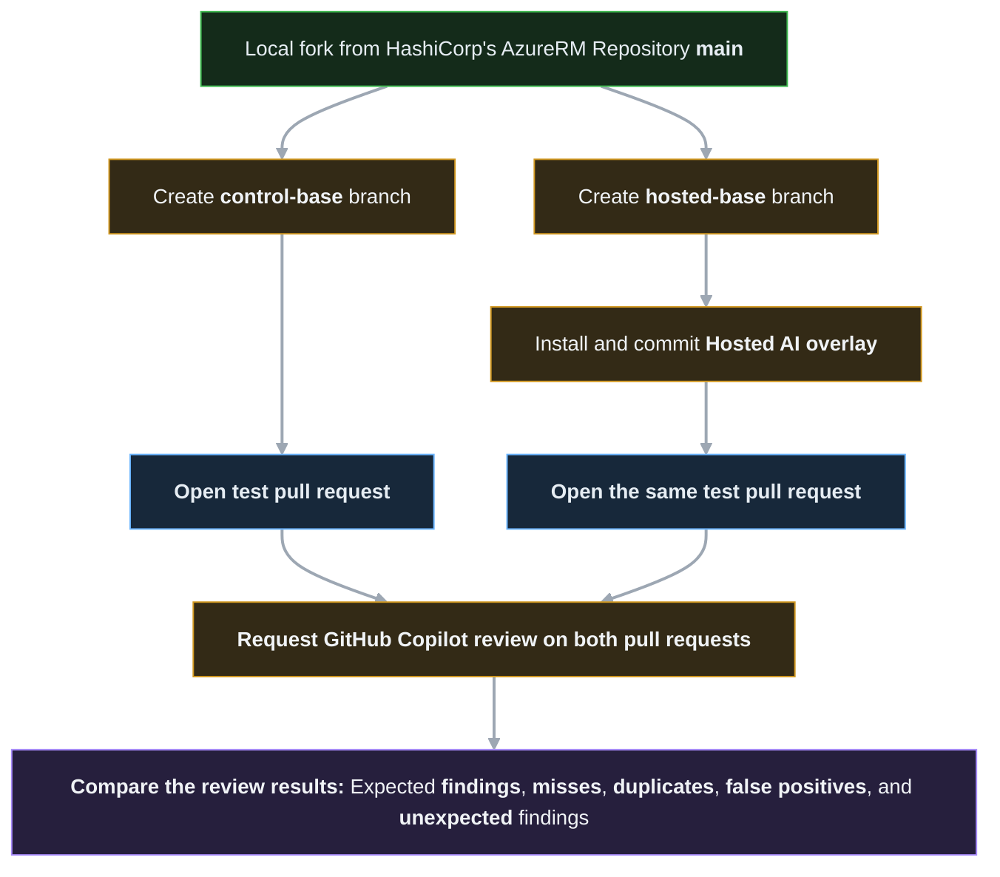

# Hosted Copilot Code Review Implementation Guide:

This guide defines how to implement the Hosted Toolkit described in [`docs/HOSTED_COPILOT_CODE_REVIEW_ARCHITECTURE.md`](../../docs/HOSTED_COPILOT_CODE_REVIEW_ARCHITECTURE.md).

The architecture document remains authoritative for product boundaries, rationale, trust, budgets, and adoption criteria. This guide owns the implementation sequence and the concrete first-party GitHub repository shape used during the Experiment MVP.

## Implementation Boundary:

Build the Hosted Toolkit directly from GitHub's documented customization model. Do not copy, transform, or depend on customization files from prior experiments in another repository.

Prior experiments are evidence about prompt limits, review behavior, and evaluation design. They are not an implementation source, migration baseline, or package layout.

All Hosted Toolkit files must be authored beneath `hosted_copilot/`. Nothing in this guide changes the Interactive Toolkit runtime, installer manifest, release bundle, or validation ownership.

## First-Party GitHub Shape:

GitHub documents the following repository customization paths for Copilot code review:

- [Repository-wide custom instructions](https://docs.github.com/en/copilot/customizing-copilot/adding-repository-custom-instructions-for-github-copilot) use `.github/copilot-instructions.md`.
- Path-specific custom instructions use `NAME.instructions.md` files beneath `.github/instructions/`.
- Each path-specific instruction file begins with YAML frontmatter containing an `applyTo` glob.
- Repository-wide and every matching path-specific instruction file are combined for a reviewed file.
- [Agent skills used by code review](https://docs.github.com/en/copilot/using-github-copilot/code-review/using-copilot-code-review#mcp-servers-and-agent-skills) live beneath `.github/skills/`; a review-focused directory name and description improve relevance.
- Repository instructions, agent instructions, and agent skills are read from the pull request head branch.
- Custom instructions must remain enabled for Copilot code review in repository settings.

The Hosted Toolkit source must mirror those destination paths exactly:

```text
hosted_copilot/
  .github/
    copilot-instructions.md
    instructions/
      azurerm-go.instructions.md
      azurerm-tests.instructions.md
      azurerm-docs.instructions.md
    skills/
      code-review/
        SKILL.md
  docs/
    HOSTED_COPILOT_CODE_REVIEW.md
    HOSTED_COPILOT_CODE_REVIEW_IMPLEMENTATION.md
  tools/
    hosted-copilot/
      CHANGELOG.md
      Install-HostedCopilot.ps1
      Test-HostedToolkit.ps1
      package-manifest.json
```

The relative path below `hosted_copilot/` is the destination path in the target repository. The implementation must not introduce a generated package directory, path-rewriting layer, Hosted release bundle, or Hosted version file.

## Experiment MVP Scope:

The Experiment MVP implements only the assets required to test whether compact Hosted guidance improves Copilot code review without reproducing the Interactive Toolkit.

**Implement During The Experiment:**

- Compact repository-wide review guidance
- Compact Go, acceptance-test, and documentation instructions
- Curated mandatory maintainer conventions identified from the Interactive Toolkit, including tribal knowledge, with each rule's requirement strength, provenance, and Hosted applicability reviewed before inclusion
- One review-focused agent skill
- A package manifest for exact deployment ownership
- A source-checkout deployment script with dry-run support
- Hosted structure, isolation, and token-budget validation
- Controlled test cases and result records for paired reviews
- User-facing Hosted setup and maintenance documentation

**Defer Until Adoption:**

- A normalized rule database
- Deterministic instruction generation
- Automated upstream contributor-document synchronization
- Production-scale regression infrastructure
- Hosted-specific CI rollout
- Versioned Hosted releases or archives

During the experiment, runtime instructions are curated source files and are frozen by Git commit. They must still preserve stable rule IDs and evidence traceability so successful rules can later move into normalized sources without changing their meaning.

## Runtime File Responsibilities:

### Repository-Wide Instructions:

`hosted_copilot/.github/copilot-instructions.md` contains only guidance needed for every Hosted review:

- Repository purpose and important evidence locations
- Actionable-defect threshold
- Evidence hierarchy
- Duplicate-feedback avoidance
- Concise inline-comment expectations
- Trust rules for Hosted customization changes
- Pointers to deterministic checks that are safe in the Hosted environment

Do not place detailed Go, test, or documentation requirements in this file.

### Go Instructions:

`hosted_copilot/.github/instructions/azurerm-go.instructions.md` uses:

```yaml
---
applyTo: "internal/**/*.go"
---
```

It contains compact, high-value rules that can identify correctness, compatibility, Azure API, Terraform state, schema, lifecycle, or provider behavior defects.

The Go instructions also apply to acceptance-test files. Shared Go requirements belong here and must not be repeated in the test supplement.

### Test Instructions:

`hosted_copilot/.github/instructions/azurerm-tests.instructions.md` uses:

```yaml
---
applyTo: "internal/**/*_test.go"
---
```

It supplements the Go instructions with acceptance-test-specific requirements. It focuses on lifecycle coverage, import behavior, assertion defects, unsafe execution claims, and established provider test patterns.

### Documentation Instructions:

`hosted_copilot/.github/instructions/azurerm-docs.instructions.md` uses:

```yaml
---
applyTo: "website/docs/**/*.html.markdown"
---
```

It contains published documentation requirements and mandatory confirmed maintainer conventions. It must include the Oxford comma requirement for documentation prose lists of three or more items.

### Review Skill:

`hosted_copilot/.github/skills/code-review/SKILL.md` defines one compact review procedure:

- Classify the changed file surface.
- Read the diff and nearest evidence needed to prove or disprove a concern.
- Apply the repository-wide and matching path-specific rules.
- Inspect existing review feedback when GitHub context makes it available.
- Suppress materially equivalent comments.
- Emit only actionable, line-addressable findings.
- Keep each comment concise and include the applicable stable rule ID.

The skill must not reproduce Interactive Toolkit roles, handoff schemas, frozen audits, moderation, presentation passes, or pending-review staging.

Mandatory requirements remain in path-specific instructions. Skill relevance is not a sufficient enforcement boundary.

## Guidance Budgets:

Use the architecture's conservative engineering budgets:

| Surface | Maximum budget |
| --- | ---: |
| Repository-wide guidance | `2K tokens` |
| Shared Go instructions | `8K tokens` |
| Test supplement | `4K tokens` |
| Documentation instructions | `8K tokens` |
| Review skill | `3K tokens` |
| Maximum combined guidance | `25K tokens` |

The Hosted validator must measure each runtime file and every applicable combined surface. A test file loads repository-wide, Go, test, and potentially relevant skill guidance; the combined check must reflect cumulative loading rather than validating each file in isolation.

Token measurement is an engineering guardrail, not a claim about GitHub's unpublished prompt-accounting implementation. The validator uses `character-quarter-estimate-25pct-v1`, based on Microsoft Learn's documented approximation that [one token is approximately four characters in English](https://learn.microsoft.com/azure/azure-functions/functions-bindings-openai-embeddings-input#usage). It calculates the raw estimate as `ceiling(character count / 4)`, applies 25% safety headroom as a local safeguard, and compares the guarded estimate with each budget. Microsoft also documents that [the specific tokenization method varies by LLM](https://learn.microsoft.com/dotnet/ai/conceptual/understanding-tokens), so text and JSON output report the estimator by name plus the raw and guarded values. This method has no external package dependency and does not claim to reproduce GitHub's undisclosed model tokenizer.

## Implementation Sequence:

### Phase One: Documentation Vertical Slice:

Create the smallest deployable review package:

- Repository-wide instructions
- Documentation instructions
- Review skill
- Initial package manifest
- Hosted installer dry-run
- Hosted validation for layout, isolation, frontmatter, and documentation-surface budget
- One controlled documentation test case with expected findings

This phase proves head-branch discovery, path matching, skill relevance, deployment, token measurement, and result capture on the best-bounded review surface.

### Phase Two: Go Review Surface:

Add compact Go instructions and controlled implementation test cases. Include only rules with clear defect impact and evidence support.

Extend validation to calculate the repository-wide plus Go plus review-skill budget.

### Phase Three: Acceptance-Test Surface:

Add the test supplement and controlled acceptance-test cases. Verify that test reviews load both Go and test instructions without duplicated rule meaning.

Extend validation to calculate the repository-wide plus Go plus test plus review-skill budget.

### Phase Four: Controlled Hosted Evaluation:

Deploy from the current source checkout into the writable test fork and run paired reviews:

- Use identical test changes and verify identical changed-file sets and diff hashes.
- Use the same review effort for each pair.
- Record the source commit and manifest hashes.
- Record observed model metadata and its evidence source when available.
- Mark comparisons with different or unknown models as confounded.
- Record expected findings, misses, duplicates, false positives, and unexpected findings.

#### Paired Branch And Pull Request Topology:

Pin the local fork's current `main` commit for the experiment. Create immutable `control-base` and `hosted-base` branches from that exact commit, then install and commit the Hosted overlay only on `hosted-base`. For every case and run, open one control test pull request against `control-base` and one Hosted test pull request against `hosted-base`. Both pull requests must contain the same planned test change.

| Experiment Path | Starting Point | Contents | Pull Request Target |
| --- | --- | --- | --- |
| Control base | Pinned local fork `main` | No Hosted overlay | None; unchanged control baseline |
| Hosted base | Same pinned local fork `main` | Hosted overlay and installed-state record | None; unchanged Hosted baseline |
| Control test PR | `control-base` | Planned test change only | `control-base` |
| Hosted test PR | `hosted-base` | Same planned test change only | `hosted-base` |



For each test, open two matching pull requests in the writable fork. The control pull request targets `control-base`, and the Hosted pull request targets `hosted-base`. Both pull requests must contain the same planned test change.

The control and Hosted test-change commits cannot have the same Git commit SHA because they have different parent commits. Equality means that both temporary source branches apply the same test change and that each pull request, measured against its corresponding base branch, has the same changed-file set and diff hash. The Hosted overlay must be inherited from `hosted-base`; it must not appear in the Hosted test pull request diff.

Before requesting either review:

- Verify `control-base` and `hosted-base` start from the same pinned local fork `main` commit.
- Verify `control-base` contains no Hosted package files.
- Verify `hosted-base` contains the manifest-owned files and installed-state record from the approved source commit.
- Verify each temporary source branch changes only the test-case paths expected for its case.
- Verify the paired pull request diffs have identical changed-file sets and diff hashes.
- Open the control pull request against `control-base` and the Hosted pull request against `hosted-base`.
- Keep `control-base` and `hosted-base` unchanged for every repeated run in the comparison set.
- Apply the same review effort, repository settings, MCP configuration, memory setting, and review trigger.
- Request both reviews within the same test window.

#### Phase Four Automation Contract:

The Phase Four orchestration scripts should make the topology and comparison gates deterministic. They should:

- Accept the pinned upstream commit, test case, run identifier, and review effort as explicit inputs.
- Create or verify immutable `control-base` and `hosted-base` branches without rewriting existing experiment history.
- Deploy the Hosted overlay only to `hosted-base` through `Install-HostedCopilot.ps1`.
- Create paired temporary source branches and apply one canonical test change to both.
- Refuse to continue when changed-file sets or diff hashes differ.
- Push both base branches and both temporary source branches, then open the control pull request against `control-base` and the Hosted pull request against `hosted-base` only after the pair passes validation.
- Record branch names, base and head commits, source commit, manifest hash, test-case identity, diff hash, pull request URLs, review effort, request timestamps, and observed model evidence.
- Keep review invocation and result capture separate from deployment approval.

Historical pull request titles are contextual evidence only. They do not select the Hosted review model and must not be treated as authoritative runtime metadata.

## Package Manifest Requirements:

`hosted_copilot/tools/hosted-copilot/package-manifest.json` owns the exact deployable file set.

The initial schema must support:

- A manifest schema version
- Source paths relative to `hosted_copilot/`
- Destination paths relative to the target repository root
- Source content hashes
- File ownership by the Hosted package
- A stable package identity for installed-state comparison

Phase One fixes these camel-case manifest properties:

- `schemaVersion`
- `packageIdentity`
- `installedStatePath`
- `files`
- `sourcePath`, `targetPath`, and `hash` for every entry in `files`

The generated installed-state record uses `schemaVersion`, `packageIdentity`, `commit`, `manifestHash`, and `files`. Each installed file records its `targetPath` and verified `hash`.

The manifest must not include the implementation guide, Hosted changelog, experiment test artifacts, or other maintainer-only files unless the target repository needs them to operate or maintain the installed Hosted Toolkit.

The installer and validator consume this shared schema rather than defining parallel interpretations.

## Installer Requirements:

`Install-HostedCopilot.ps1` runs from this source checkout and accepts an explicit target repository directory.

**Dry-Run Behavior:**

- Resolve all paths through the manifest.
- Report additions, updates, unchanged files, owned modifications, and unowned collisions.
- Write nothing to the target repository.
- Report the source Git commit when available.
- Exit nonzero for an invalid manifest, missing source, unsafe path, or unapproved collision.

**Install Behavior:**

- Merge into existing `.github/`, `tools/`, and `docs/` directories without replacing unrelated content.
- Create only manifest-owned destination files.
- Fail closed when an unowned destination already exists.
- Require explicit approval before replacing a collision or locally modified package-owned file.
- Verify every copied file against its source hash.
- Record installed hashes and source commit for later ownership checks.

The Hosted installer must not call, import, overwrite, or otherwise depend on the Interactive Toolkit installer or `installer/file-manifest.config`.

## Validation Requirements:

`Test-HostedToolkit.ps1` remains the complete Hosted profile validator. As each phase is implemented, extend it to enforce:

- Required Hosted layout
- Valid instruction frontmatter and exact `applyTo` patterns
- Review-focused skill metadata
- Package-manifest schema and complete owned-file coverage
- Source-hash agreement
- No Interactive Toolkit runtime dependencies
- No Hosted `VERSION` or release bundle
- Per-file and cumulative token budgets
- Installer dry-run behavior against a temporary target
- Markdown validity
- Mermaid rendering with explicitly pinned, supported Mermaid CLI and Puppeteer versions
- Controlled test-case schema and result completeness

The validator must continue to distinguish design phase from runtime phase. Runtime gates become mandatory when `.github/` runtime assets or `package-manifest.json` appear.

Text output must use the same execution-state contract as the Interactive Toolkit one-shot validator:

- Report the Hosted purpose, deployment model, and current `DESIGN` or `RUNTIME` phase before executing checks
- Report each check transition with `[RUNNING]`, `[PASSED]`, `[FAILED]`, or `[SKIPPED]`
- Treat phase-dependent checks that do not apply as `SKIPPED`, not `PASSED`
- Report the duration of every executed check
- End with a check, status, and duration table plus detailed failure output when applicable

JSON output must suppress all progress and presentation text. It must return only the structured result containing the same overall status, purpose, deployment model, phase, check statuses, durations, and issues represented by text mode.

## Deployment And Repository Settings:

Use a writable fork for implementation and controlled evaluation. Deployment to another maintainer's repository requires that repository's owner or administrator to approve files and configure settings.

Before requesting a Hosted review:

- Deploy the overlay through the Hosted installer dry run and review every collision.
- Install only after the exact plan is approved.
- Commit the deployed files on the pull request head branch.
- Confirm custom instructions are enabled for Copilot code review.
- Select and record the review effort.
- Confirm any required agent skill and MCP settings are available.

GitHub's built-in MCP server is read-only for the current repository by default. Additional MCP tools are repository settings, not files owned by this overlay, and must be separately approved by a repository administrator.

## Experiment Acceptance Gates:

The Experiment MVP is complete only when:

- Documentation, Go, and acceptance-test reviews complete without the captured prompt-size failure.
- Every runtime path is first-party supported and manifest owned.
- The installer can preview and deploy without modifying unrelated target files.
- The Hosted validator passes all cumulative guidance budgets.
- Controlled comparisons use identical test-change diffs and review effort.
- Results distinguish useful findings, misses, duplicates, false positives, and model-confounded runs.
- The evidence supports an explicit decision to adopt, revise, or stop the Hosted Toolkit direction.

Passing the experiment does not automatically authorize production generation, synchronization, CI, or release machinery. Those remain adoption decisions.

## Naming Consistency And Immediate Next Step:

The Hosted package manifest, installed-state record, installer, and validator must reuse existing Interactive Toolkit terminology when an equivalent concept already exists. Equivalent concepts must not be renamed solely because they belong to the Hosted Toolkit. Introduce Hosted-specific terminology only when the direct source-deployment model has no Interactive Toolkit equivalent.

The following minimum vocabulary is fixed for the Hosted implementation:

| Concept | Shared term | Hosted use |
| --- | --- | --- |
| Target repository directory | `RepoDirectory` | Installer parameter and resolved deployment root |
| Manifest file location | `ManifestPath` | Path to `package-manifest.json` |
| Parsed manifest | `ManifestConfig` | Validated manifest data consumed by the installer and validator |
| Source file | `SourcePath` | Path beneath `hosted_copilot/` |
| Target file | `TargetPath` | Corresponding path beneath `RepoDirectory` |
| Source provenance | `Commit` | Git commit of the source checkout when available |
| Content integrity | `Hash` | SHA-256 value for source, target, and installed-state comparisons |
| Validation result | `Valid`, `Reason`, and `Issues` | Structured validation outcome and diagnostics |
| Operation result | `Success` | Structured installer outcome |
| Execution state | `Status` | `running`, `passed`, `failed`, or `skipped` check state |
| Check duration | `DurationSeconds` | Elapsed execution time for a validation check |

This table fixes shared conceptual terminology, not JSON property casing. The manifest schema must apply one consistent casing convention when its properties are implemented.

Hosted-only concepts with no Interactive equivalent, including the installed-state record, per-file package ownership, and installed hashes, may introduce new terms. Those terms must remain consistent between the manifest, installer, validator, and user-facing Hosted documentation.

Do not carry Interactive-only version, build-fingerprint, release-bundle, or archive terminology into the Hosted Toolkit. The Hosted Toolkit remains unversioned and source deployed.

With this naming convention established, the local Phase One documentation package, Phase Two Go package, and Phase Three acceptance-test package are implemented. The next step is Phase Four: deploy the approved source package into the writable test fork and run controlled Hosted evaluation. Deployment and Hosted evaluation remain separate approval steps; no target-repository deployment is authorized by these implementation milestones alone.
