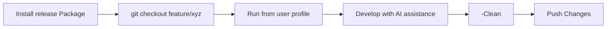
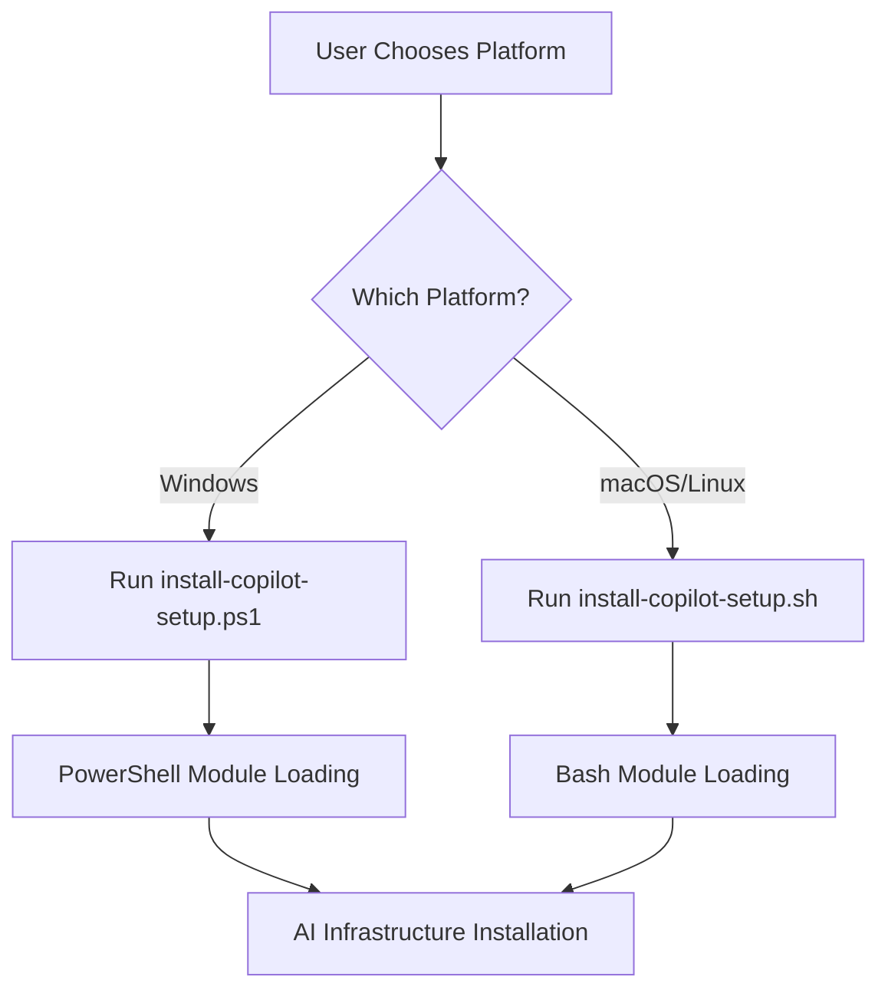

<picture>
  <source media="(prefers-color-scheme: dark)" srcset="../.github/installerTitle-dark.png">
  <source media="(prefers-color-scheme: light)" srcset="../.github/installerTitle-light.png">
  
</picture>

> **Intelligent setup tool for AI-powered Terraform AzureRM Provider development**
##

> [!IMPORTANT]
> **📦 Release-Based Installation**: This installer is now distributed as standalone release bundles.
> Download the latest version from [GitHub Releases](https://github.com/WodansSon/terraform-azurerm-ai-assisted-development/releases/latest) instead of cloning the repository.

This installer provides GitHub Copilot instructions, VS Code configurations, and AI-powered development workflows for the Terraform AzureRM Provider repository.

## 🌍 Cross-Platform Support

The installer supports **Windows**, **macOS**, and **Linux** with flexible platform options:

- **PowerShell** (Cross-platform): Works on Windows and macOS
- **Bash** (Unix-like): Traditional option for macOS and Linux

### 🪟 Windows (PowerShell)
**Recommended for Windows environments:**
```powershell
.\install-copilot-setup.ps1 -Help
.\install-copilot-setup.ps1 -Bootstrap
.\install-copilot-setup.ps1 -RepoDirectory "C:\path\to\repo"
```

> [!WARNING]
> If you encounter PowerShell execution policy errors, see [Windows PowerShell Execution Policy](#windows---powershell-execution-policy) section below.

### 🐧 macOS/Linux

**Option 1: PowerShell Core (Cross-Platform)**
```bash
# Install PowerShell Core
brew install powershell

# Run the installer
pwsh ./install-copilot-setup.ps1 -Help
pwsh ./install-copilot-setup.ps1 -Bootstrap
pwsh ./install-copilot-setup.ps1 -RepoDirectory "/path/to/repo"
```

**Option 2: Bash (Traditional)**
```bash
./install-copilot-setup.sh -help
./install-copilot-setup.sh -bootstrap
./install-copilot-setup.sh -repo-directory "/path/to/repo"
```

### 🔧 Installation Paths
- **Windows**: `%USERPROFILE%\.terraform-azurerm-ai-installer`
- **macOS/Linux**: `~/.terraform-azurerm-ai-installer`

### 🚀 Quick Start for macOS

If you're on macOS and want to use the PowerShell version:

```bash
# 1. Install PowerShell Core (one-time setup)
brew install powershell

# 2. Run the installer
pwsh ./install-copilot-setup.ps1 -Help
pwsh ./install-copilot-setup.ps1 -Bootstrap
```

## ✨ User Experience

The installer provides a **clean, professional output** focused on what matters:

- **📋 Clear progress indicators** - Section headers and completion status
- **🎯 Focused messaging** - Only essential information, no technical noise
- **✅ Success confirmations** - Clear indication when operations complete
- **📊 File operation tracking** - Detailed file copy/install status
- **🎨 Consistent formatting** - Identical output quality across Windows PowerShell and macOS/Linux Bash

**Example output (consistent across Windows PowerShell and macOS/Linux Bash):**
```
============================================================
 Terraform AzureRM Provider - AI Infrastructure Installer
 VERSION: 1.0.0
============================================================

 SOURCE BRANCH DETECTED : main
 WORKSPACE              : C:\path\to\terraform-azurerm-ai-assisted-development

============================================================
 Bootstrap - Copying Installer to User Profile
============================================================

Copying installer files from current repository...

   Copying: file-manifest.config      [OK]
   Copying: install-copilot-setup.ps1 [OK]
   Copying: install-copilot-setup.sh  [OK]
   Copying: ConfigParser.psm1         [OK]
   Copying: FileOperations.psm1       [OK]
   Copying: ValidationEngine.psm1     [OK]
   Copying: UI.psm1                   [OK]
   Copying: configparser.sh           [OK]
   Copying: fileoperations.sh         [OK]
   Copying: validationengine.sh       [OK]
   Copying: ui.sh                     [OK]

 Bootstrap completed successfully

============================================================
 BOOTSTRAP SUMMARY:
============================================================

DETAILS:
  Items Successful: 11
  Total Size      : 181.5 KB
  Location        : C:\Users\<username>\.terraform-azurerm-ai-installer
  Files Copied    : 11

NEXT STEPS:

  1. Switch to your feature branch:
     git checkout feature/your-branch-name

  2. Run the installer from your user profile:
     cd "$env:USERPROFILE\.terraform-azurerm-ai-installer"
     .\install-copilot-setup.ps1 -RepoDirectory "<path-to-your-terraform-provider-azurerm>"
```

> [!NOTE]
> The `-RepoDirectory` parameter tells the installer where to find the git repository for branch detection when running from your user profile.

## 🚀 Getting Started

> [!IMPORTANT]
> **Critical: Correct Extraction Location**
>
> The installer **MUST** be extracted to your user profile directory:
> - **Windows**: `$env:USERPROFILE\.terraform-azurerm-ai-installer\`
> - **macOS/Linux**: `~/.terraform-azurerm-ai-installer/`
>
> **Do NOT run the installer from:**
> - Downloads folder
> - Desktop
> - Temporary directories
> - Arbitrary locations
>
> Running from incorrect locations will cause **directory traversal errors** and the installer will fail with errors like:
> ```
> A positional parameter cannot be found that accepts argument 'settings.json'
> ```
>
> The installer requires a specific directory structure to load modules and configuration files correctly.

### 🌍 Cross-Platform Quick Start

Choose your platform and follow the two-step process:

**Windows (PowerShell):**
```powershell
# Step 1: Download and extract to user profile (one-time setup)
Invoke-WebRequest -Uri "https://github.com/WodansSon/terraform-azurerm-ai-assisted-development/releases/latest/download/terraform-azurerm-ai-installer.zip" -OutFile "$env:TEMP\terraform-azurerm-ai-installer.zip"
Expand-Archive -Path "$env:TEMP\terraform-azurerm-ai-installer.zip" -DestinationPath "$env:USERPROFILE\.terraform-azurerm-ai-installer" -Force

# Step 2: Install AI infrastructure (from user profile)
& "$env:USERPROFILE\.terraform-azurerm-ai-installer\install-copilot-setup.ps1" -RepoDirectory "C:\path\to\terraform-provider-azurerm"
```

**macOS/Linux (Bash):**
```bash
# Step 1: Download and extract to user profile (one-time setup)
curl -L -o /tmp/terraform-azurerm-ai-installer.tar.gz "https://github.com/WodansSon/terraform-azurerm-ai-assisted-development/releases/latest/download/terraform-azurerm-ai-installer.tar.gz"
mkdir -p ~/.terraform-azurerm-ai-installer
tar -xzf /tmp/terraform-azurerm-ai-installer.tar.gz -C ~/.terraform-azurerm-ai-installer --strip-components=1

# Step 2: Install AI infrastructure (from user profile)
~/.terraform-azurerm-ai-installer/install-copilot-setup.sh -repo-directory "/path/to/terraform-provider-azurerm"
```

> [!NOTE]
> **Install a specific version (pinning)**: replace `latest/download` with a tagged release URL (`download/vX.Y.Z`).
>
> The version is the `vX.Y.Z` segment in the URL path. The filename can be either the stable (unversioned) asset name or the versioned asset name.
>
> - Example pinned URL (stable filename):
>   - `https://github.com/WodansSon/terraform-azurerm-ai-assisted-development/releases/download/v1.0.1/terraform-azurerm-ai-installer.tar.gz`
> - Example pinned URL (versioned filename):
>   - `https://github.com/WodansSon/terraform-azurerm-ai-assisted-development/releases/download/v1.0.1/terraform-azurerm-ai-installer-v1.0.1.tar.gz`

### 📁 Installation Location

The installer extracts to your user profile:
- **Windows**: `%USERPROFILE%\.terraform-azurerm-ai-installer`
- **macOS/Linux**: `~/.terraform-azurerm-ai-installer`

Once installed, you can run the installer from any directory on any branch by specifying the `-RepoDirectory` parameter.

> [!TIP]
> **For Contributors**: If you have the repository cloned locally, you can use `-Bootstrap` to copy from source instead of downloading the release bundle.

### 📋 Prerequisites

#### System Requirements

**For Windows:**
- Windows PowerShell 5.1+ or PowerShell Core 7+
- Git (standard installation)

**For macOS Users (PowerShell Option):**
- **PowerShell Core 7+** installed (via `brew install powershell`)
- Standard Unix tools (git, which are typically available)

**For macOS/Linux Users (Bash Option):**
- Bash shell environment
- Standard Unix tools (git, curl, which are typically available)

#### VS Code Extensions

Before using the AI-powered development features, ensure you have the following VS Code extensions installed:

#### Required Extensions
- **[GitHub Copilot](https://marketplace.visualstudio.com/items?itemName=GitHub.copilot)** - Core AI assistance and code generation
- **[GitHub Copilot Chat](https://marketplace.visualstudio.com/items?itemName=GitHub.copilot-chat)** - Interactive AI chat and slash commands

#### Recommended Configuration
For optimal performance and the best AI assistance experience:

- **LLM Model**: **Claude Sonnet 4.5** (optimal for Terraform and Go development)
- **Copilot Chat Model**: Set to `Claude Sonnet 4.5` in VS Code settings
- **Alternative**: GPT-4o (good alternative if Claude is unavailable)

#### Quick Setup
1. Install the required extensions from VS Code marketplace
2. Sign in to GitHub Copilot with your account
3. Configure `Claude Sonnet 4.5` as your preferred model:
   - Open VS Code Settings (`Ctrl+,`)
   - Search for "copilot chat model"
   - Select `Claude Sonnet 4.5` from the dropdown

> [!NOTE]
> `Claude Sonnet 4.5` provides superior understanding of Terraform patterns, Azure API specifics, and Go code generation compared to other models.

### First Time Setup

Download and extract the latest installer bundle directly to your user profile:

**Windows (PowerShell):**
```powershell
# Download the latest installer bundle
Invoke-WebRequest -Uri "https://github.com/WodansSon/terraform-azurerm-ai-assisted-development/releases/latest/download/terraform-azurerm-ai-installer.zip" -OutFile "$env:TEMP\terraform-azurerm-ai-installer.zip"

# Extract directly to user profile (equivalent to -Bootstrap)
Expand-Archive -Path "$env:TEMP\terraform-azurerm-ai-installer.zip" -DestinationPath "$env:USERPROFILE\.terraform-azurerm-ai-installer" -Force

# Verify installation
& "$env:USERPROFILE\.terraform-azurerm-ai-installer\install-copilot-setup.ps1" -Help
```

**macOS/Linux (Bash):**
```bash
# Download the latest installer bundle
curl -L -o /tmp/terraform-azurerm-ai-installer.tar.gz "https://github.com/WodansSon/terraform-azurerm-ai-assisted-development/releases/latest/download/terraform-azurerm-ai-installer.tar.gz"

# Extract directly to user profile (equivalent to -bootstrap)
mkdir -p ~/.terraform-azurerm-ai-installer
tar -xzf /tmp/terraform-azurerm-ai-installer.tar.gz -C ~/.terraform-azurerm-ai-installer --strip-components=1

# Verify installation
~/.terraform-azurerm-ai-installer/install-copilot-setup.sh -help
```

> [!TIP]
> **For Contributors**: If you're contributing to this project and have the repository cloned locally, you can use the `-Bootstrap` command to copy from source:
> ```bash
> # From the cloned repository
> cd terraform-azurerm-ai-assisted-development/installer
> ./install-copilot-setup.sh -bootstrap  # or .\install-copilot-setup.ps1 -Bootstrap on Windows
> ```

### ⚠️ Platform-Specific Considerations

#### Windows - PowerShell Execution Policy

If you encounter execution policy errors on Windows, you have several options:

##### Option 1: Bypass for single execution (Recommended)
```powershell
# Run with execution policy bypass (safest for one-time use)
powershell -ExecutionPolicy Bypass -File .\installer\install-copilot-setup.ps1 -Bootstrap

# Or for the user profile installer
powershell -ExecutionPolicy Bypass -File "$env:USERPROFILE\.terraform-azurerm-ai-installer\install-copilot-setup.ps1"
```

##### Option 2: Unblock the downloaded files
```powershell
# Unblock all installer files
Get-ChildItem -Path .\installer -Recurse | Unblock-File
.\installer\install-copilot-setup.ps1 -Bootstrap
```

##### Option 3: Set execution policy for current user (Permanent)
```powershell
# Allow local scripts for current user
Set-ExecutionPolicy -ExecutionPolicy RemoteSigned -Scope CurrentUser
.\installer\install-copilot-setup.ps1 -Bootstrap
```

#### macOS/Linux - Script Permissions

If you encounter permission errors on macOS/Linux:

```bash
# Make scripts executable
chmod +x installer/*.sh

# Then run the installer
./install-copilot-setup.sh -bootstrap
```

## 🚀 Quick Start

### Two-Step Process (Any Platform)

**Step 1: Download and Extract to User Profile (One-time setup)**

Download the installer bundle and extract directly to your user profile:

**Windows:**
```powershell
# Download and extract to user profile
Invoke-WebRequest -Uri "https://github.com/WodansSon/terraform-azurerm-ai-assisted-development/releases/latest/download/terraform-azurerm-ai-installer.zip" -OutFile "$env:TEMP\terraform-azurerm-ai-installer.zip"
Expand-Archive -Path "$env:TEMP\terraform-azurerm-ai-installer.zip" -DestinationPath "$env:USERPROFILE\.terraform-azurerm-ai-installer" -Force

# Verify installation
& "$env:USERPROFILE\.terraform-azurerm-ai-installer\install-copilot-setup.ps1" -Help
```

> [!WARNING]
> **PowerShell Execution Policy**: If you get execution policy errors when running the installer, use:
> ```powershell
> powershell -ExecutionPolicy Bypass -File "$env:USERPROFILE\.terraform-azurerm-ai-installer\install-copilot-setup.ps1" -Help
> ```

**macOS/Linux:**
```bash
# Download and extract to user profile
curl -L -o /tmp/terraform-azurerm-ai-installer.tar.gz "https://github.com/WodansSon/terraform-azurerm-ai-assisted-development/releases/latest/download/terraform-azurerm-ai-installer.tar.gz"
mkdir -p ~/.terraform-azurerm-ai-installer
tar -xzf /tmp/terraform-azurerm-ai-installer.tar.gz -C ~/.terraform-azurerm-ai-installer --strip-components=1

# Verify installation
~/.terraform-azurerm-ai-installer/install-copilot-setup.sh -help
```

**Step 2: Install AI Infrastructure (Whenever you work on a feature branch)**

Navigate to your Terraform AzureRM Provider repository and run the installer:

**Windows:**
```powershell
# Navigate to your Terraform provider repository
cd C:\path\to\terraform-provider-azurerm

# Switch to your feature branch
git checkout feature/your-branch-name

# Install AI infrastructure from user profile
& "$env:USERPROFILE\.terraform-azurerm-ai-installer\install-copilot-setup.ps1" -RepoDirectory "C:\path\to\terraform-provider-azurerm"
```

**macOS/Linux:**
```bash
# Navigate to your Terraform provider repository
cd /path/to/terraform-provider-azurerm

# Switch to your feature branch
git checkout feature/your-branch-name

# Install AI infrastructure from user profile
~/.terraform-azurerm-ai-installer/install-copilot-setup.sh -repo-directory "/path/to/terraform-provider-azurerm"
```

> [!NOTE]
> The `-RepoDirectory` parameter is required when running from your user profile to tell the installer where your AzureRM Provider git repository is located.

## 📋 What Gets Installed

The installer sets up a complete AI development environment:

### 📄 Core AI Instructions
- `.github/copilot-instructions.md` - Main Copilot configuration
- `.github/instructions/` - 13 specialized instruction files:
  - `implementation-guide.instructions.md` - Complete coding standards
  - `azure-patterns.instructions.md` - Azure-specific patterns
  - `testing-guidelines.instructions.md` - Testing requirements
  - `documentation-guidelines.instructions.md` - Doc standards
  - `error-patterns.instructions.md` - Error handling
  - `migration-guide.instructions.md` - Version migration
  - `provider-guidelines.instructions.md` - Provider patterns
  - `schema-patterns.instructions.md` - Schema design
  - `code-clarity-enforcement.instructions.md` - Code quality
  - `performance-optimization.instructions.md` - Performance
  - `security-compliance.instructions.md` - Security patterns
  - `troubleshooting-decision-trees.instructions.md` - Debugging
  - `api-evolution-patterns.instructions.md` - API versioning

### 🎨 Development Templates & AI Prompts
- `.github/prompts/` - AI prompt templates for common development tasks:

### ⚙️ VS Code Configuration
- `.vscode/settings.json` - Optimized VS Code settings for Terraform development
  - Go formatting and linting configurations
  - Terraform extension settings
  - Workspace-specific editor preferences

> [!NOTE]
> The `.vscode/settings.json` file contains **workspace-specific settings** that only apply to this repository. Your personal VS Code user settings will remain unchanged.

## How to Use Prompts

### **In GitHub Copilot Chat:**
Simply use slash commands to invoke the prompts directly:

| Slash Command | Prompt File | Description |
|---------------|-------------|-------------|
| `/code-review-local-changes` | `code-review-local-changes.prompt.md` | Review your uncommitted changes |
| `/code-review-committed-changes` | `code-review-committed-changes.prompt.md` | Review committed changes |

**Example Usage:**
```
/code-review-local-changes
/code-review-committed-changes
```

#### Available Prompts

| Prompt File | Purpose | Usage |
|-------------|---------|-------|
| `code-review-local-changes.prompt.md` | **Review uncommitted changes** with Terraform provider best practices | Use before committing to get expert feedback on your local changes |
| `code-review-committed-changes.prompt.md` | **Review committed changes** for pull request feedback | Use to review git commits with detailed technical analysis |

## 🎛️ Command Reference

### Platform-Specific Commands

**Windows (PowerShell):**

| Command | Description | Available On |
|---------|-------------|--------------|
| `.\install-copilot-setup.ps1 -Bootstrap` | **Copy installer to user profile from cloned repo** (contributors only) | When cloned locally |
| `& "$env:USERPROFILE\.terraform-azurerm-ai-installer\install-copilot-setup.ps1" -RepoDirectory "C:\path\to\repo"` | **Install AI infrastructure** (run from anywhere after setup) | Feature branches |
| `& "$env:USERPROFILE\.terraform-azurerm-ai-installer\install-copilot-setup.ps1" -Verify -RepoDirectory "C:\path\to\repo"` | **Check installation status** (run from anywhere after setup) | Any branch |
| `& "$env:USERPROFILE\.terraform-azurerm-ai-installer\install-copilot-setup.ps1" -Clean -RepoDirectory "C:\path\to\repo"` | **Remove AI infrastructure** (run from anywhere after setup) | Feature branches |
| `& "$env:USERPROFILE\.terraform-azurerm-ai-installer\install-copilot-setup.ps1" -Help` | **Show detailed help** (run from anywhere after setup) | Any branch |

**macOS/Linux (Bash):**

| Command | Description | Available On |
|---------|-------------|--------------|
| `./install-copilot-setup.sh -bootstrap` | **Copy installer to user profile from cloned repo** (contributors only) | When cloned locally |
| `~/.terraform-azurerm-ai-installer/install-copilot-setup.sh -repo-directory "/path/to/repo"` | **Install AI infrastructure** (run from anywhere after bootstrap) | Feature branches |
| `~/.terraform-azurerm-ai-installer/install-copilot-setup.sh -verify -repo-directory "/path/to/repo"` | **Check installation status** (run from anywhere after bootstrap) | Any branch |
| `~/.terraform-azurerm-ai-installer/install-copilot-setup.sh -clean -repo-directory "/path/to/repo"` | **Remove AI infrastructure** (run from anywhere after bootstrap) | Feature branches |
| `~/.terraform-azurerm-ai-installer/install-copilot-setup.sh -help` | **Show detailed help** (run from anywhere after bootstrap) | Any branch |

### Parameters

**Windows (PowerShell):**

| Parameter | Description | Required When | Example |
|-----------|-------------|---------------|---------|
| `-RepoDirectory` | **Specify repository path** | Running from user profile | `-RepoDirectory "C:\path\to\terraform-provider-azurerm"` |
| `-Contributor` | **Enable contributor mode for testing AI file changes** | Testing AI infrastructure changes | `-Contributor -Branch "feature/test"` |
| `-Branch` | **Install from specific GitHub branch** (requires `-Contributor`) | Testing published branch changes | `-Contributor -Branch "feature/new-feature"` |
| `-LocalPath` | **Copy from local AI dev repo** (requires `-Contributor`) | Testing uncommitted local changes | `-Contributor -LocalPath "C:\dev\terraform-azurerm-ai-assisted-development"` |
| `-Dry-Run` | Preview changes without applying | Optional | `-Dry-Run` |

**macOS/Linux (Bash):**

| Parameter | Description | Required When | Example |
|-----------|-------------|---------------|---------|
| `-repo-directory` | **Specify repository path** | Running from user profile | `-repo-directory "/path/to/terraform-provider-azurerm"` |
| `-contributor` | **Enable contributor mode for testing AI file changes** | Testing AI infrastructure changes | `-contributor -branch "feature/test"` |
| `-branch` | **Install from specific GitHub branch** (requires `-contributor`) | Testing published branch changes | `-contributor -branch "feature/new-feature"` |
| `-local-path` | **Copy from local AI dev repo** (requires `-contributor`) | Testing uncommitted local changes | `-contributor -local-path "/path/to/terraform-azurerm-ai-assisted-development"` |
| `-dry-run` | Preview changes without applying | Optional | `-dry-run` |

### 🚨 Important: Repository Directory Parameter

When running the installer **from your user profile** (after initial setup), you **MUST** specify the repository directory parameter:

*Windows:*
```powershell
# ✅ CORRECT: Running from user profile with RepoDirectory
& "$env:USERPROFILE\.terraform-azurerm-ai-installer\install-copilot-setup.ps1" -RepoDirectory "C:\path\to\terraform-provider-azurerm"

# ❌ INCORRECT: Running from user profile without RepoDirectory
& "$env:USERPROFILE\.terraform-azurerm-ai-installer\install-copilot-setup.ps1"
```

*macOS/Linux:*
```bash
# ✅ CORRECT: Running from user profile with -repo-directory
~/.terraform-azurerm-ai-installer/install-copilot-setup.sh -repo-directory "/Users/<username>/terraform-provider-azurerm"

# ❌ INCORRECT: Running from user profile without -repo-directory
~/.terraform-azurerm-ai-installer/install-copilot-setup.sh
```

**Why is this required?**
- The installer needs to know where your git repository is located
- Enables proper branch detection and workspace validation
- Ensures files are installed in the correct repository directory

**How did the installer get to your user profile?**

There are two ways to set up the installer in your user profile:

#### 🌐 **Option 1: Download Release Package (Recommended for Most Users)**
Download the pre-packaged installer bundle and extract it directly to your user profile. This is the **standard workflow** for most users:

**Windows:**
```powershell
# Download and extract the latest release to user profile
Invoke-WebRequest -Uri "https://github.com/WodansSon/terraform-azurerm-ai-assisted-development/releases/latest/download/terraform-azurerm-ai-installer.zip" -OutFile "$env:TEMP\terraform-azurerm-ai-installer.zip"
Expand-Archive -Path "$env:TEMP\terraform-azurerm-ai-installer.zip" -DestinationPath "$env:USERPROFILE\.terraform-azurerm-ai-installer" -Force

# Verify installation
& "$env:USERPROFILE\.terraform-azurerm-ai-installer\install-copilot-setup.ps1" -Help
```

**macOS/Linux:**
```bash
# Download and extract the latest release to user profile
curl -L -o /tmp/terraform-azurerm-ai-installer.tar.gz "https://github.com/WodansSon/terraform-azurerm-ai-assisted-development/releases/latest/download/terraform-azurerm-ai-installer.tar.gz"
mkdir -p ~/.terraform-azurerm-ai-installer
tar -xzf /tmp/terraform-azurerm-ai-installer.tar.gz -C ~/.terraform-azurerm-ai-installer --strip-components=1

# Verify installation
~/.terraform-azurerm-ai-installer/install-copilot-setup.sh -help
```

#### 🔧 **Option 2: Bootstrap from Local Clone (For Contributors)**
If you're **contributing to this AI infrastructure project** and have it cloned locally, you can use `-Bootstrap` to copy the installer to your user profile from your local repository:

**Windows:**
```powershell
# Clone the AI infrastructure repository (one-time)
git clone https://github.com/WodansSon/terraform-azurerm-ai-assisted-development.git
cd terraform-azurerm-ai-assisted-development/installer

# Bootstrap from your local clone
.\install-copilot-setup.ps1 -Bootstrap

# Now you can run from user profile
& "$env:USERPROFILE\.terraform-azurerm-ai-installer\install-copilot-setup.ps1" -Help
```

**macOS/Linux:**
```bash
# Clone the AI infrastructure repository (one-time)
git clone https://github.com/WodansSon/terraform-azurerm-ai-assisted-development.git
cd terraform-azurerm-ai-assisted-development/installer

# Bootstrap from your local clone
./install-copilot-setup.sh -bootstrap

# Now you can run from user profile
~/.terraform-azurerm-ai-installer/install-copilot-setup.sh -help
```

**When to use each option:**
- **Option 1 (Download Release)**: 99% of users - You just want to use the AI infrastructure for Terraform development
- **Option 2 (Bootstrap)**: You're contributing to the AI infrastructure project itself and need to test local changes to the installer or instruction files

## 🌊 Workflow Overview

### Branch-Aware Architecture

The installer adapts its behavior based on your current Git branch:

#### 🔹 Source Branch (`main`)
- Contains the master AI infrastructure files
- **Bootstrap mode**: Copies installer to user profile for feature branch use
- **Verification**: Checks source files integrity
- **Protection**: Prevents accidental deletion of development files

#### 🔹 Feature Branches (any other branch)
- Target for AI infrastructure installation
- **Install mode**: Sets up complete AI development environment
- **Clean mode**: Removes AI infrastructure when needed
- **Verification**: Checks installed files status

### Typical Development Workflow



## 🏗️ Architecture

### Two-Silo Architecture

```
AIinstaller/
├── install-copilot-setup.ps1      # Windows PowerShell installer
├── install-copilot-setup.sh       # macOS/Linux Bash installer
├── README.md                      # This file
├── file-manifest.config           # File configuration (shared)
└── modules/                       # Platform-specific modules
    ├── powershell/                # PowerShell modules (Windows)
    │   ├── ConfigParser.psm1      # Configuration management
    │   ├── FileOperations.psm1    # File installation/removal
    │   ├── ValidationEngine.psm1  # System validation
    │   └── UI.psm1                # User interface functions
    └── bash/                      # Bash modules (macOS/Linux)
        ├── configparser.sh        # Configuration management
        ├── fileoperations.sh      # File installation/removal
        ├── validationengine.sh    # System validation
        └── ui.sh                  # User interface functions
```

### Platform Detection & Execution Flow



## 🔄 Automated Deprecation Management

The installer includes **intelligent deprecation management** that automatically maintains your AI development environment:

### ✨ Smart File Lifecycle Management

During each installation, the tool automatically:

- **🔍 Scans** existing instruction and prompt files in your workspace
- **📋 Compares** them against the current manifest from the source branch
- **🗑️ Removes** deprecated files that are no longer part of the AI infrastructure
- **✅ Preserves** current files that remain active

### 🎯 What Gets Managed

**Instruction Files** (`.github/instructions/`)
- `*.instructions.md` files for AI coding guidelines
- Automatic removal of outdated instruction patterns
- Ensures you always have the latest AI development guidance

**Prompt Files** (`.github/prompts/`)
- `*.prompt.md` files for AI interaction templates
- Removes obsolete prompt templates
- Keeps your prompt library current and effective

### 💡 How It Works

**Automatic During Installation:**
```powershell
# Windows - deprecation check runs automatically
.\install-copilot-setup.ps1 -RepoDirectory "C:\path\to\repo"

# Output example:
# Checking for deprecated files...
#   Removed deprecated instruction file: old-pattern.instructions.md
#   Removed deprecated prompt file: legacy-prompt.prompt.md
#   Removed 2 deprecated file(s)
```

```bash
# macOS/Linux - deprecation check runs automatically
./install-copilot-setup.sh -repo-directory "/path/to/repo"

# Output example:
# Checking for deprecated files...
#   Removed deprecated instruction file: old-pattern.instructions.md
#   Removed deprecated prompt file: legacy-prompt.prompt.md
#   Removed 2 deprecated file(s)
```

**Dry-Run Preview:**
```powershell
# Preview what would be removed (Windows)
.\install-copilot-setup.ps1 -Dry-Run -RepoDirectory "C:\path\to\repo"

# Output example:
# [DRY-RUN] Would remove instruction file: old-pattern.instructions.md
# [DRY-RUN] Would remove prompt file: legacy-prompt.prompt.md
# Found 2 deprecated file(s) that would be removed
```

### 🛡️ Safety Features

- **Non-destructive preview** with `-Dry-Run` / `-dry-run` flag
- **Branch protection** - Only operates on feature branches, never on source branch
- **Manifest validation** - Only removes files not in current official manifest
- **Error handling** - Graceful handling of permission issues or file locks

### 🚀 Benefits

- **🎯 Always Current**: Your AI environment stays synchronized with the latest patterns
- **🧹 Clean Workspace**: No accumulation of obsolete AI guidance files
- **⚡ Zero Maintenance**: Fully automatic - no manual cleanup required
- **🔄 Version Sync**: Ensures your local environment matches the source branch requirements

## 🎯 AI Prompt Usage Patterns

### Quick Start with Prompts

Once the AI infrastructure is installed, you can leverage the powerful prompt templates for common development tasks:

#### 🔍 Code Review Workflow
```
# Review your current changes before committing
/code-review-local-changes

# Review specific committed changes
/code-review-committed-changes for commit abc123
```

### Advanced Prompt Techniques

#### 🎯 Context-Specific Usage
Combine slash commands with specific context for better results:

```
# Review specific Azure service implementation
/code-review-local-changes focusing on Azure CDN Front Door patterns

# Review changes with specific focus areas
/code-review-committed-changes and ensure Azure SDK integration follows best practices
```

#### 🔄 Iterative Development
Use slash commands in sequence for complete development workflows:

```
1. # Review your implementation patterns against Azure provider guidelines
2. # Make your code changes
3. /code-review-local-changes before committing
4. /code-review-committed-changes after committing for final review
```

#### 🎨 Custom Prompt Combinations
Combine multiple commands for complex tasks:

```
# Comprehensive development review
/code-review-local-changes AND ensure the code follows Azure patterns from .github/instructions/
```

## 🔍 Usage Examples

### Install AI Infrastructure

**Windows:**
```powershell
# After installing to user profile - run from anywhere
& "$env:USERPROFILE\.terraform-azurerm-ai-installer\install-copilot-setup.ps1" -RepoDirectory "C:\path\to\terraform-provider-azurerm"
```

**macOS/Linux:**
```bash
# After installing to user profile - run from anywhere
~/.terraform-azurerm-ai-installer/install-copilot-setup.sh -repo-directory "/path/to/terraform-provider-azurerm"
```

### Check Current AI Infrastructure File Status

**Windows:**
```powershell
# After installing to user profile - run from anywhere
& "$env:USERPROFILE\.terraform-azurerm-ai-installer\install-copilot-setup.ps1" -Verify -RepoDirectory "C:\path\to\terraform-provider-azurerm"
```

**macOS/Linux:**
```bash
# After installing to user profile - run from anywhere
~/.terraform-azurerm-ai-installer/install-copilot-setup.sh -verify -repo-directory "/path/to/terraform-provider-azurerm"
```

### Clean AI Infrastructure Files From Your Terraform Provider Feature Branch

**Windows:**
```powershell
# After installing to user profile - run from anywhere
& "$env:USERPROFILE\.terraform-azurerm-ai-installer\install-copilot-setup.ps1" -Clean -RepoDirectory "C:\path\to\terraform-provider-azurerm"

# Preview what would be removed
& "$env:USERPROFILE\.terraform-azurerm-ai-installer\install-copilot-setup.ps1" -Clean -Dry-Run -RepoDirectory "C:\path\to\terraform-provider-azurerm"
```

**macOS/Linux:**
```bash
# After installing to user profile - run from anywhere
~/.terraform-azurerm-ai-installer/install-copilot-setup.sh -clean -repo-directory "/path/to/terraform-provider-azurerm"

# Preview what would be removed
~/.terraform-azurerm-ai-installer/install-copilot-setup.sh -clean -dry-run -repo-directory "/path/to/terraform-provider-azurerm"
```

### Contributor Mode - Testing AI Instruction Changes

> [!NOTE]
> **This feature is ONLY for contributors working on this AI infrastructure project.** End users never need `Contributor Mode` - simply download the release package to your user profile and run the installer normally to set up AI assistance in your Terraform provider feature branch.

Contributors working on AI instruction files in this repository (terraform-azurerm-ai-assisted-development) can test their changes before merging them into their feature branch using the two scenarios below. These scenarios allow you to test how your AI instruction changes will work when copied to the HashiCorp terraform-provider-azurerm repository:

#### Scenario 1: Test Published Branch Changes

Test AI instruction changes from a GitHub branch (already pushed, not yet merged to main):

**Windows:**
```powershell
& "$env:USERPROFILE\.terraform-azurerm-ai-installer\install-copilot-setup.ps1" -Contributor -Branch feature/new-instructions -RepoDirectory "C:\path\to\terraform-provider-azurerm"
```

**macOS/Linux:**
```bash
~/.terraform-azurerm-ai-installer/install-copilot-setup.sh -contributor -branch feature/new-instructions -repo-directory ~/terraform-provider-azurerm
```

#### Scenario 2: Test Uncommitted Local Changes

Test AI instruction changes from your local working directory (including uncommitted changes):

**Windows:**
```powershell
& "$env:USERPROFILE\.terraform-azurerm-ai-installer\install-copilot-setup.ps1" -Contributor -LocalPath "C:\dev\terraform-azurerm-ai-assisted-development" -RepoDirectory "C:\path\to\terraform-provider-azurerm"
```

**macOS/Linux:**
```bash
~/.terraform-azurerm-ai-installer/install-copilot-setup.sh -contributor -local-path ~/dev/terraform-azurerm-ai-assisted-development -repo-directory ~/terraform-provider-azurerm
```

#### Safety Constraints

**CRITICAL REQUIREMENTS:**
- **`-Contributor` flag is REQUIRED** for both `-Branch` and `-LocalPath` (enforced gatekeeper pattern)
- **`-Branch` and `-LocalPath` are mutually exclusive** (cannot use both together)
- **Cannot use with `-Bootstrap`** (Bootstrap always uses current local branch)
- **Only for AI infrastructure contributors** (end users should download release packages)

**Why these constraints exist:**
- Prevents accidental AI infrastructure modifications on production branches
- Ensures contributors explicitly acknowledge they're testing infrastructure changes
- Maintains clear separation between end-user workflows and contributor testing

### Using Bootstrap for Local Development

Bootstrap is a **one-time convenience setup** that copies the installer to your user profile. After bootstrapping, you can easily install AI infrastructure to whatever feature branch you're currently working on in your local HashiCorp terraform-provider-azurerm repository.

**Windows:**
```powershell
# One-time setup: Bootstrap from THIS repo's main branch
cd C:\path\to\terraform-azurerm-ai-assisted-development
.\installer\install-copilot-setup.ps1 -Bootstrap

# Then whenever you're working on a feature branch in your HashiCorp repo:
cd C:\path\to\terraform-provider-azurerm
git checkout feature/your-feature-branch

# Install AI infrastructure to your current branch
& "$env:USERPROFILE\.terraform-azurerm-ai-installer\install-copilot-setup.ps1" -RepoDirectory "C:\path\to\terraform-provider-azurerm"
```

**macOS/Linux:**
```bash
# One-time setup: Bootstrap from THIS repo's main branch
cd ~/terraform-azurerm-ai-assisted-development
./installer/install-copilot-setup.sh -bootstrap

# Then whenever you're working on a feature branch in your HashiCorp repo:
cd ~/terraform-provider-azurerm
git checkout feature/your-feature-branch

# Install AI infrastructure to your current branch
~/.terraform-azurerm-ai-installer/install-copilot-setup.sh -repo-directory ~/terraform-provider-azurerm
```

> [!TIP]
> Bootstrap once, then install to any feature branch you're working on. The installer always installs to whatever branch is currently checked out in the repository path you specify.

## 🛠️ Troubleshooting

### Common Issues

#### ❌ "Bootstrap can only be run from source branch"
**Solution**: Switch to `main` branch before running bootstrap.

#### ❌ "Clean operation not available on source branch"
**Solution**: Switch to a feature branch before running clean operations.

#### ❌ "Contributor mode requires either -Branch or -LocalPath parameter"
**Solution**: When using `-Contributor` flag, you must specify either:
- `-Branch feature/branch-name` to test published branch changes, OR
- `-LocalPath "C:\path\to\local\repo"` (Windows) or `-local-path ~/path/to/local/repo` (macOS/Linux) to test uncommitted local changes

#### ❌ "Cannot use both -Branch and -LocalPath together"
**Solution**: Choose one testing mode:
- Use `-Branch` to test changes from a GitHub branch (already pushed)
- Use `-LocalPath` / `-local-path` to test local uncommitted changes
- These are mutually exclusive - you cannot use both at the same time

#### ❌ "Contributor mode cannot be used with Bootstrap"
**Solution**: Contributor mode is only available when running from your user profile installer:
```powershell
# Windows - Run from user profile, not from cloned repo
& "$env:USERPROFILE\.terraform-azurerm-ai-installer\install-copilot-setup.ps1" -Contributor -Branch feature/test -RepoDirectory "C:\path\to\terraform-provider-azurerm"
```
```bash
# macOS/Linux - Run from user profile, not from cloned repo
~/.terraform-azurerm-ai-installer/install-copilot-setup.sh -contributor -branch feature/test -repo-directory ~/terraform-provider-azurerm
```

#### ❌ "DIRECTORY NOT FOUND: The specified RepoDirectory does not exist"
**Solution**:
- Check the path spelling and ensure it exists
- Use an absolute path (e.g., `C:\path\to\repo`)
- Ensure you have permissions to access the directory

#### ❌ "INVALID REPOSITORY: The specified directory does not appear to be a terraform-azurerm-ai-assisted-development repository"
**Solution**:
- Ensure you're pointing to the repository ROOT directory
- Verify the directory contains the `installer/` folder and repository files
- Example: `-RepoDirectory 'C:\path\to\terraform-azurerm-ai-assisted-development'`

#### ❌ Module import errors
**Solution**: Ensure you're running from the correct directory with all PowerShell modules present.

### Manual Recovery

If the installer becomes corrupted in your user profile:

```powershell
# Re-bootstrap from the repository
cd C:\path\to\terraform-azurerm-ai-assisted-development
.\installer\install-copilot-setup.ps1 -Bootstrap
```

```bash
# macOS/Linux
cd ~/terraform-azurerm-ai-assisted-development
./installer/install-copilot-setup.sh -bootstrap
```

This will refresh the installer copy in your user profile (`~/.terraform-azurerm-ai-installer`).

## 📄 License

This is a community-maintained project licensed under the Mozilla Public License 2.0 (MPL-2.0). See the [LICENSE](../LICENSE) file for details.

---

**Need help?** Run `.\install-copilot-setup.ps1 -Help` for interactive assistance.
